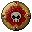

# 🔱 Evento Lanceiro

## » Como Funciona

* Usando apenas tridentes, mate o ultimo sobrevivente na arena e torne-se o vencedor ou mate a maior quantidade de inimigos e torne-se o matador;
* Itens definidos pela equipe; (armadura de diamante, 16 maçãs douradas, 64 bifes e 2 tridentes);

<figure><figcaption></figcaption></figure>

* As habilidades do mcMMO serão ativadas durante o evento;
* Borda que reduz no decorrer da batalha;\
  Com o decorrer do tempo a borda do mapa vai reduzindo para que não seja um evento cansativo em que jogadores ficam correndo pelo mapa.

## » Como Participar

1.  Entrar no evento:

    * O tempo de entrada do evento é de **10 minutos;**
    * Enquanto o evento estiver aberto, **limpe seu inventário** e use o comando `/warp eventos` e entre no portal de água a frente;
    * Saia do evento a qualquer momento com `/batalha sair`&#x20;

2. Preparação para o evento:
   * Após o evento ser fechado você será teleportado para a arena onde ocorrera a batalha;
   * Você terá 30 segundos para se preparar para a batalha.&#x20;
3. Inicio da batalha:
   * Após passar o tempo de preparação será iniciado o combate todos x todos.

## » Regras Gerais

#### 1. Não é permitido a formação de times.

Formação de time ou grupos no evento Lanceiro não é permitido. Jogadores que forem flagrados em times ou grupos serão penalizados.

* Em casos de formações de alianças os jogadores serão expulsos do evento e serão punidos por anti -jogo. conforme diz a [Regra 15](../../regras/jogabilidade.md#id-01-5).

#### 2. É estritamente proibido participar com mais de uma conta por jogador.

* Em casos de jogadores que entrarem com mais de uma conta serão expulsos do evento e serão punidos também por anti-jogo.

#### **3. Utilização de programas, mods hackers ou qualquer tipo de trapaça que deem vantagens no combate.**

Qualquer suspeita de utilização de trapaça durante o combate, a equipe poderá solicitar compartilhamento de tela do jogador através do [programa Any Desk que pode ser baixado aqui.](https://anydesk.com/pt/downloads) Além de violar a [Regra 18](https://wiki.rederevo.com/regras/jogabilidade#01-7) do servidor, saiba todas as regras em [**Regras**](../../regras/).

## » Premiação

#### 🥇 **Ultimo Sobrevivente**

* 💰 Premiação de **50.000 Coins**
* &#x1F48E;**\[Liga]** 25 Pontos
*  **Contador de Peixes Pescados**&#x20;

#### [☠️](https://emojipedia.org/skull-and-crossbones/) **Matador**

* 💰 Premiação de 10**0.000 Coins**
*  TAG **\[Lanceiro(a)]** durante 7 dias
* Tridente do Lanceiro.
* 💎 **\[Liga]** 50 Pontos

