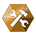
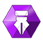

# 👑 Equipe

## &#x20;<mark style="color:yellow;">Diretor</mark>

**Dirige**, **planeja**, **organiza** e controla as atividades de diversas áreas, fixando políticas de gestão dos recursos financeiros, administrativos, estruturação, racionalização, e adequação dos serviços diversos. Desenvolve planejamento estratégico, identifica oportunidades, avalia a viabilidade e faz recomendações sobre novos investimentos ou desenvolvimento de novos negócios.

#### Funções:

* [x] Manter o servidor e seus sistemas atualizados;
* [x] Tirar dúvidas de jogadores realizadas por tickets ou chat;
* [x] Realização de eventos, como os eventos de construção;
* [x] Corrigir erros e bugs causados pelos sistemas do servidor;
* [x] Contratar novos membros para a equipe;
* [x] Aprovar, reprovar e implementar sugestões de jogadores.

#### Lista de Diretores

*  <mark style="color:yellow;">**Nevisk**</mark>**&#x20; (data de entrada: 21/05/2021)**
*  <mark style="color:yellow;">**thiagogebrim**</mark>**&#x20; (data de entrada: 21/05/2021)**

##  <mark style="color:blue;">Gerente</mark>

O cargo de **gerente** tem muita relevância e sempre possui muitas responsabilidades. Ele é responsável por manter a organização dos processos e, normalmente, está sempre tomando decisões muito importantes para o desenvolvimento do servidor.

#### Funções:

* [x] Tirar dúvidas de jogadores realizadas por tickets ou chat;
* [x] Realização de eventos, como os eventos de construção;
* [x] Contratar novos membros para a equipe;
* [x] Organização geral nos servidores.

##  <mark style="color:purple;">Desenvolvedor(a)</mark>

O **desenvolvedor** é o profissional que desenvolve _plugins e os demais sistemas do servidor._ Seu trabalho envolve o entendimento, uso e aplicação de diferentes linguagens de programação, como **java**, **kotlin**, **scala**, além da análise de dados e atualizações sobre o Minecraft que podem ser fundamentais na atualização e/ou melhorias nos sistemas do servidor.

#### Funções:

* [x] Desenvolver sistemas para o servidor;
* [x] Auxiliar os diretores na resolução de problemas.

## ​ <mark style="color:orange;">Técnico(a)</mark> 

Manter e reparar equipamentos tecnológicos, orientar e coordenar o sistema de segurança da Rede Revo, investigando riscos e causas de falhas, analisando esquemas de prevenção.

#### Funções: 

* [x] Configurar hardwares e instalar e configurar softwares e drivers;
* [x] Gerenciar opções de segurança e softwares nas maquinas da rede para manter a privacidade e a proteção contra ataques;
* [x] Diagnosticar falhas ou erros de sistema e fornecer soluções para restaurar a funcionalidade.

##  <mark style="color:red;">Administrador</mark>

**O administrador administra e não executa**. A responsabilidade do administrador é coordenar pessoas e recursos, assim, ele consegue atingir os objetivos traçados. Para conseguir aplicar as tarefas de administrador é preciso delegar as tarefas de execução, e evitar perder tempo realizando tarefas de execução.

#### Funções:

* [x] Tirar dúvidas de jogadores realizadas por tickets ou chat;
* [x] Realização de eventos, como os eventos de construção;
* [x] Reportar bugs ou erros aos superiores;
* [x] Ficar atento nos cargos inferiores, repassando aos superiores o desempenho da equipe;
* [x] Trabalho de prevenção junto aos jogadores, conscientizando-os sobre os riscos que correm ao desrespeitar as [regras](../regras/).

##  <mark style="color:green;">Moderador</mark>

A equipe de moderação está encarregada de conservar um ambiente amigável. Os moderadores são jogadores voluntários a quem concedemos confiança, além de ferramentas para que possam manter a jogatina o mais agradável possível.

#### Funções:

* [x] Tirar dúvidas de jogadores realizadas por tickets ou chat;
* [x] Reportar bugs ou erros aos superiores;
* [x] Moderar o chat dos servidores e discord;
* [x] Trabalho de prevenção junto aos jogadores, conscientizando-os sobre os riscos que correm ao desrespeitar as [regras](../regras/).

##  <mark style="color:green;">Moderador GC</mark>

O termo "**GC-Detector**" é derivado de "**Detector de Ghost Clients**", que consiste em uma pessoa que dentro de um "universo" de Minecraft/Servidores tenha um conhecimento avançado em detecção de trapaças "incomuns", sendo elas: "JavaEdit, Injection Client, Ghost Client" entre outras trapaças.

#### Funções:

* [x] Verificar se jogadores estão utilizando algum tipo de trapaça.

##  <mark style="color:orange;">Coordenador de Equipe</mark>

##  <mark style="color:orange;">Construtor</mark>

O **construtor** será responsável pelo desenvolvimento de toda construção realizada no servidor, ficando sob sua supervisão as adequadas medidas técnicas e administrativas para a sua perfeita e integral execução e entrega formal ao final dos trabalhos.

#### Funções:

* [x] Construir estruturas para os servidores;
* [x] Atualizar construções existentes nos servidores;
* [x] Recursos para uso em construções é disponibilizado apenas em um servidor exclusivo para a staff.

##  <mark style="color:yellow;">Ajudante</mark>

O **Ajudante** é o responsável pelo auxílio imediato em diversas funções e também garante o suporte necessário esclarecendo todas as dúvidas dos jogadores.

#### Funções:

* [x] Tirar dúvidas de jogadores realizadas por tickets ou chat;
* [x] Reportar bugs ou erros aos superiores;
* [x] Moderar o chat dos servidores e discord;
* [x] Trabalho de prevenção junto aos jogadores, conscientizando-os sobre os riscos que correm ao desrespeitar as [regras](../regras/).

##  <mark style="color:green;">Aprendiz</mark>

O **Aprendiz** é um cargo em treinamento para ingressar na equipe do servidor, além de garantir o suporte necessário esclarecendo todas as dúvidas dos jogadores.

#### Funções:

* [x] Tirar dúvidas de jogadores realizadas por tickets ou chat;
* [x] Reportar bugs ou erros aos superiores;
* [x] Trabalho de prevenção junto aos jogadores, conscientizando-os sobre os riscos que correm ao desrespeitar as [regras](../regras/).

##  <mark style="color:purple;">Designer</mark>

O **Designer** é o responsável pelo desenvolvimento da parte visual do servidor.

#### Funções:

* [x] Renovação da parte visual do servidor;
* [x] Criação de texturas e imagens para o servidor.
