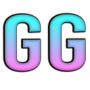
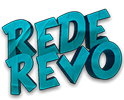
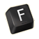
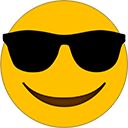
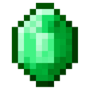
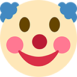
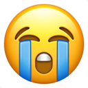
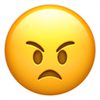
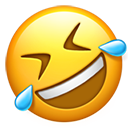

# Revo Pack

### Lista de emojis para utilizar no servidor

.png>) = :peposleep:\
 = :gg: \
 = :revo:\
 = :pray: ou :reza: \
 = :flushed: ou :evergonhado: \
 = :kekw: \
 = :f: \
 = :sunglasses:\
 = :emerald: ou :esmeralda: \
 = :clown: ou :palhaço: \
 = :chorando: ou :sob:\
 = :apaixoado: ou :heart\_eyes:\
 = :pleading\_face: ou :drama: \
 = :angry: ou :nervoso: \
 = :like:, :joia: ou :thumbsup: \
 = :sunglasso\_bravo: \
 = :rofl: ou :risos:

