# 🌾 Herbalismo

Herbalismo é uma habilidade no McMMO que governa a capacidade de colher plantas e culturas, excluindo árvores e outras ocorrências mais estruturais de plantas. Requer várias ferramentas para fazer o uso completo de suas habilidades.

* [x] Ferramentas usadas:  Enxada (para a habilidade [Terra Verde](terra-verde.md)),  Espada (para a habilidade [Sorte de Hylian](sorte-de-hylian.md)) e mão.
* [x] Habilidades: _Ativas:_ Terra Verde, Polegar Cogumelo; _Passivas:_ Polegar Verde, Dieta de Fazendeiro, Sorte de Hylian, Drops Duplos.
* [x] Interage com:  Pedregulho,  Tijolos de Pedra,  Terra e  Plantações em um geral.
* [x] Up ao quebrar plantações com enxada.

## » Habilidades


[sorte-de-hylian.md](sorte-de-hylian.md)



[polegar-cogumelo.md](polegar-cogumelo.md)



[drops-duplos-de-plantacoes.md](drops-duplos-de-plantacoes.md)



[terra-verde.md](terra-verde.md)



[dieta-do-fazendeiro.md](dieta-do-fazendeiro.md)



[polegar-verde.md](polegar-verde.md)


## » Técnicas

**Cana-de-açúcar:** Uma fazenda ideal é modelada para maximizar a eficiência do espaço. Uma fazenda grande o suficiente pode ser colhida sem parar. A cana-de-açúcar pode crescer até três blocos de altura, e quebrar o meio de um caule adulto rende 60 anos de exp total. Além de dar uma boa taxa de EXP e não precisar replantar, rende uma boa quantidade de dinheiro.

* Prós: Sem replantio, não precisa de luz
* Contras: A cana-de-açúcar requer água próxima ao bloco em que é plantada, tornando-a menos eficiente em termos de espaço do que outras culturas. Cresce em um ritmo bastante lento. Exigir espaço massivo para otimização.

**Fungo do Nether:**

* Prós: A taxa de crescimento mais rápida entre todas as culturas sem água ou luz.
* Contras: Para plantar é necessário Areia das Almas para plantar. A velocidade de caminhada lenta na Areia das Almas também pode impedir a colheita e o replantio, a menos que você tenha o encantamento Soul Speed.

**Trigo/Cenoura/Batata/Beterraba**:

* Prós: Muito eficiente em termos de espaço, pode ser construído verticalmente. Condições ideais exigem apenas um bloco de água para cada área de fazenda 9x9. O up nessas plantações quando você estiver acima dos 1000 níveis de Herbalismo, é a melhor opção pois, com a colheita com uma enxada, a fazenda é 100% replantada automaticamente.
* Contras: Requer manutenção pesada e não oferece vantagens de velocidade em comparação com outros métodos baseados em fazendas. Não pode ser automatizado, e a fazenda deve ser totalmente crescida a cada colheita para ganhar a quantidade máxima de pontos de habilidade, perdendo tempo se alguém microgerencia sua fazenda ou não.

**Melancia/Abóbora:**

* Prós: Não é necessário o replantio, em plantações grandes o tempo-benefício é o melhor.
* Contras: O espaço usado para a plantação é maior do que uma de trigo ou cenoura, mas, a não necessariedade de replantio compensa isto.

## » Tabela de EXP ganho


EXP ganho apenas em blocos (plantações) no estágio máximo (se tiver) e se for bloco (plantação) não colocada por um jogador (quando a plantação muda de estágio de crescimento, muda essa estatística).


<table><thead><tr><th>» Blocos «</th><th align="center">» EXP «</th><th data-hidden></th></tr></thead><tbody><tr><td> Trigo</td><td align="center">65</td><td></td></tr><tr><td>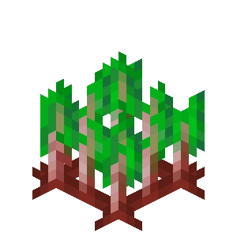 Beterraba</td><td align="center">70</td><td></td></tr><tr><td>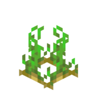 Batata</td><td align="center">55</td><td></td></tr><tr><td>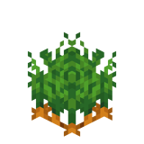 Cenoura</td><td align="center">65</td><td></td></tr><tr><td>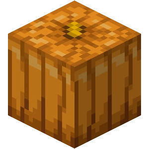 Abóbora</td><td align="center">20</td><td></td></tr><tr><td>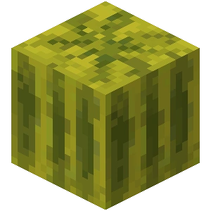 Melancia</td><td align="center">20</td><td></td></tr><tr><td>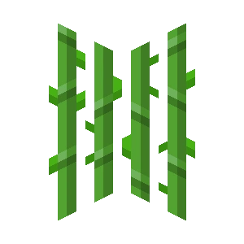 Cana-de-Açúcar</td><td align="center">35</td><td></td></tr><tr><td>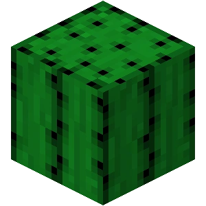 Cacto</td><td align="center">50</td><td></td></tr><tr><td> Cacau</td><td align="center">30</td><td></td></tr><tr><td>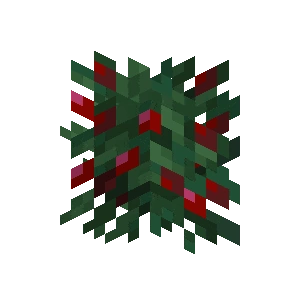 Bagas Doces</td><td align="center">50</td><td></td></tr><tr><td>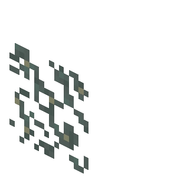 Líquen Brilhante</td><td align="center">75</td><td></td></tr><tr><td> Plantaforma Grande</td><td align="center">75</td><td></td></tr><tr><td>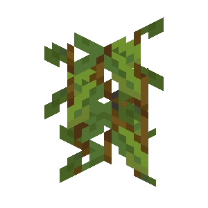 Vinhas das cavernas</td><td align="center">80</td><td></td></tr><tr><td>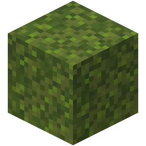 Bloco de Musgo</td><td align="center">25</td><td></td></tr><tr><td>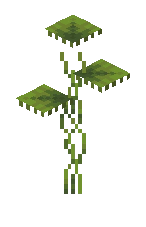 Plantaforma Pequena</td><td align="center">80</td><td></td></tr><tr><td>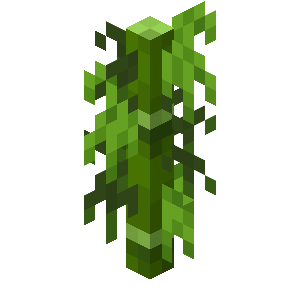 Bambu</td><td align="center">15</td><td></td></tr><tr><td>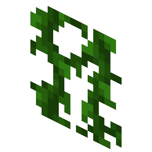 Vinhas</td><td align="center">20</td><td></td></tr><tr><td>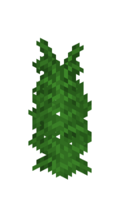 Samambaia Alta</td><td align="center">50</td><td></td></tr><tr><td>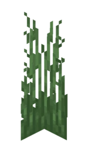 Grama Alta</td><td align="center">50</td><td></td></tr><tr><td> Grama</td><td align="center">10</td><td></td></tr><tr><td>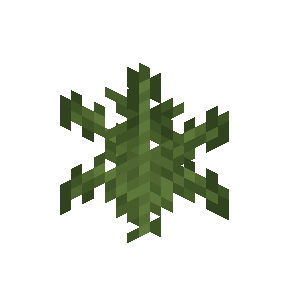Samambaia</td><td align="center">10</td><td></td></tr><tr><td> Cogumelo Vermelho</td><td align="center">15</td><td></td></tr><tr><td>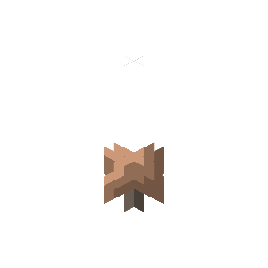 Cogumelo Marrom</td><td align="center">15</td><td></td></tr><tr><td>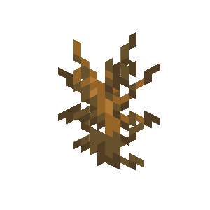 Arbusto Seco</td><td align="center">30</td><td></td></tr><tr><td> Colmeia</td><td align="center">500</td><td></td></tr><tr><td> Allium</td><td align="center">30</td><td></td></tr><tr><td>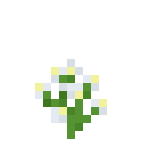 Jasmim</td><td align="center">15</td><td></td></tr><tr><td>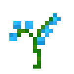 Orquídea Azul</td><td align="center">15</td><td></td></tr><tr><td>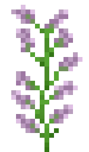 Flores de 2 de Altura (Lilás, Roseira, Peônia e Girassol)</td><td align="center">50</td><td></td></tr><tr><td>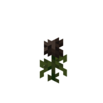 Rosa do Wither</td><td align="center">200</td><td></td></tr><tr><td>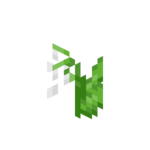 Lírio do Vale</td><td align="center">15</td><td></td></tr><tr><td> Centáurea</td><td align="center">15</td><td></td></tr><tr><td>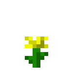 Dente de Leão</td><td align="center">10</td><td></td></tr><tr><td> Papoula</td><td align="center">10</td><td></td></tr><tr><td>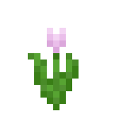 Tulipa (Todas Cores)</td><td align="center">15</td><td></td></tr><tr><td> Margarida</td><td align="center">15</td><td></td></tr><tr><td>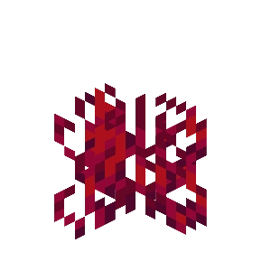 Raízes Carmesim</td><td align="center">60</td><td></td></tr><tr><td>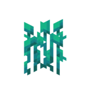 Raízes Distorcidas</td><td align="center">60</td><td></td></tr><tr><td> Bloco de Fungos do Nether</td><td align="center">60</td><td></td></tr><tr><td> Bloco de Fungos Distorcidos</td><td align="center">60</td><td></td></tr><tr><td> Brotos do Nether</td><td align="center">15</td><td></td></tr><tr><td> Fungo Carmesim</td><td align="center">75</td><td></td></tr><tr><td> Fungo Distorcido</td><td align="center">75</td><td></td></tr><tr><td>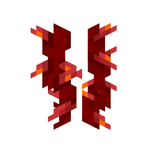 Trepadeiras Carmesim</td><td align="center">10</td><td></td></tr><tr><td>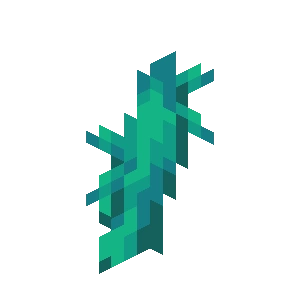 Trepadeiras Retorcidas</td><td align="center">10</td><td></td></tr><tr><td> Cogubrilho</td><td align="center">300</td><td></td></tr><tr><td> Fungo do Nether</td><td align="center">85</td><td></td></tr><tr><td>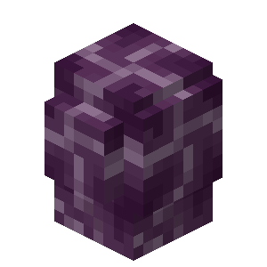 Planta do Coro</td><td align="center">1</td><td></td></tr><tr><td>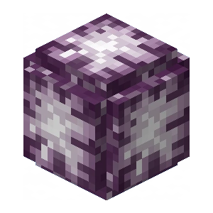 Flor do Coro</td><td align="center">25</td><td></td></tr></tbody></table>
