# 🪓 Lenhador

**Lenhador** é uma habilidade que se baseia em derrubar árvores com um machado. Aumentar a habilidade aumenta as chances de queda de madeira extra das árvores, bem como a duração extra da habilidade de derrubador de árvores.

* [x] Ferramenta usada: Machado de qualquer material.
* [x] Interage com:  Madeira,  Folha e  Blocos de Cogumelo.
* [x] Habilidades: _Ativas:_ Derrubador de Árvores (desativada); _Passivas:_ Drops Duplos, Soprador de Árvores.

## » Habilidades


[derrubador-de-arvores.md](derrubador-de-arvores.md)



[soprador-de-arvores.md](soprador-de-arvores.md)



[colheita-de-madeira.md](colheita-de-madeira.md)


## » Técnicas

### Uso:

Para evoluir a habilidade é necessário quebrar madeiras ou blocos de cogumelo, quanto mais quebrar, mais benefícios.

### Up - Dicas:

* Crie um grande bosque de bétulas, depois corte e replante o máximo de árvores possível. Isso ocorre porque as bétulas não se transformarão nas grandes árvores nas quais as mudas de carvalho podem crescer.
* Crie uma árvore de cogumelo usando farinha de osso em cogumelos plantados em terra, terra grossa, blocos de grama, terra enraizada, blocos de musgo, micélio ou podzol. Cogumelos podem ser plantados em micélio ou podzol em qualquer nível de luz. Essa é uma das melhores técnicas de up.
* Poções Haste II podem ser fabricadas a partir da habilidade Alquimia após o nível 125 de Alquimia. Eles permitirão que você corte árvores mais rapidamente. Para agilizar ainda mais, você pode cortar as árvores com um Machado Supremo de Eficiência VI, adquirido através da Caixa Épica.

## » Tabela de EXP ganho


EXP ganho apenas por quebra de blocos gerados naturalmente ou por farinha de osso!


| » Bloco «                                                                                                                                      | » EXP « |   |
| ---------------------------------------------------------------------------------------------------------------------------------------------- | :-----: | - |
| 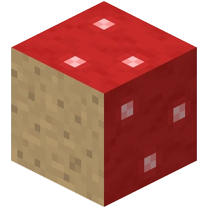 Bloco de Cogumelo Vermelho            |    70   |   |
| 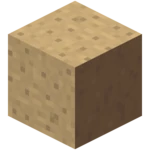 Bloco de Cogumelo Marrom               |    70   |   |
| 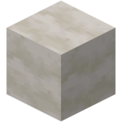 Caule de Cogumelo                                     |    80   |   |
| 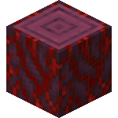 Tronco Carmesim (Todas Variações)               |   110   |   |
| 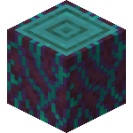 Tronco Distorcido (Todas Variações)              |   110   |   |
|  Tronco de Carvalho (Todas Variações)             |    70   |   |
| 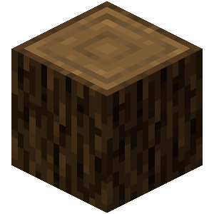 Tronco de Pinheiro (Todas Variações)              |    80   |   |
| 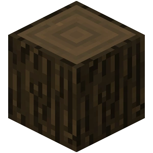 Tronco de Carvalho Escudo (Todas Variações) |    90   |   |
|  Tronco de Bétula (Todas Variações)                              |    90   |   |
| 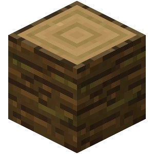 Tronco da Selva (Todas Variações)                 |    90   |   |
| 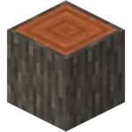 Tronco de Acácia (Todas Variações)                             |    90   |   |
| 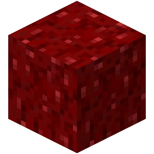 Bloco de Fungos do Nether                       |    2    |   |
| 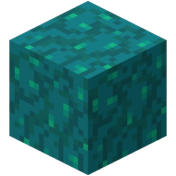 Bloco de Fungos Distorcidos do Nether           |    2    |   |
|  Cogubrilho                                            |   180   |   |
