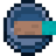

# 🤜 Desarmado

## » Habilidades


[quebra-blocos.md](quebra-blocos.md)



[braco-de-aco.md](braco-de-aco.md)



[furia.md](furia.md)



[quebra-de-limite.md](quebra-de-limite.md)



[desviar-flechas.md](desviar-flechas.md)


## » Técnicas

## » Tabela de EXP ganho


A quantidade de EXP ganho em habilidades de combate aumenta de acordo com dano dado.

EXP ganho apenas em hits dados em mobs gerados naturalmente (mobs de spawner não dão EXP).


| » Mob «                                                                                                                                                                                                                                                                                            | » EXP « |   |   |   |   |
| -------------------------------------------------------------------------------------------------------------------------------------------------------------------------------------------------------------------------------------------------------------------------------------------------- | :-----: | - | - | - | - |
| 
 Mobs Pacíficos (Burro, Mula, Cavalo-Esqueleto, Cavalo, Lhama, Coelho, Galinha, Morcego, Vaca, Ovelha, Porco, Lula, Jaguatirica, Aldeão, Papagaio, Lhama do Viajante, Aldeão 

Viajante, Raposa, Gato e Peixe)
 |   1,0   |   |   |   |   |
|  Abelha                                                                                                                                                                                                              |   1,5   |   |   |   |   |
|  Cavalo-Zumbi                                                                                                                                                                                                     |   1,2   |   |   |   |   |
|  Vaca Cogumelo                                                                                                                                                                                               |   1,2   |   |   |   |   |
|  Tartaruga                                                                                                                                                                                                              |   1,1   |   |   |   |   |
|  Golfinho                                                                                                                                                                                                              |   1,3   |   |   |   |   |
|  Lula Brilhante                                                                                                                                                                                                 |   1,5   |   |   |   |   |
|  Cabra                                                                                                                                                                                                            |   1,5   |   |   |   |   |
|  Axolote                                                                                                                                                                                                      |   1,75  |   |   |   |   |
|  Golem de Neve                                                                                                                                                                                                |   0,0   |   |   |   |   |
|  Golem de Ferro                                                                                                                                                                                             |   5,0   |   |   |   |   |
|  Urso Polar e Panda                                                                                                                                                                                                 |   2,0   |   |   |   |   |
|  Creeper                                                                                                                                                                                                               |   5,0   |   |   |   |   |
|  Esqueleto                                                                                                                                                                                                  |   3,0   |   |   |   |   |
|  Aranha                                                                                                                                                                                                         |   2,0   |   |   |   |   |
|  Zumbi Gigante                                                                                                                                                                                                          |   4,0   |   |   |   |   |
|  Zumbi e Zumbi Aldeão                                                                                                                                                                                                   |   2,0   |   |   |   |   |
|  Afogado                                                                                                                                                                                   |   1,0   |   |   |   |   |
|  Bruxa                                                                                                                                                                                                                |   0,1   |   |   |   |   |
|  Slime e Cubo de Magma                                                                                                                                                                                           |   2,0   |   |   |   |   |
|  Enderman                                                                                                                                                                                                          |   3,5   |   |   |   |   |
|  Aranha das Cavernas                                                                                                                                                                                               |   3,0   |   |   |   |   |
|  Traça                                                                                                                                                                                                      |   3,0   |   |   |   |   |
|  Guardião                                                                                                                                                                                                             |   1,0   |   |   |   |   |
|  Guardião-Mestre                                                                                                                                                                                                |   4,0   |   |   |   |   |
|  Zumbi-Múmia                                                                                                                                                                                                    |   3,0   |   |   |   |   |
|  Invocador                                                                                                                                                                                                    |   3,0   |   |   |   |   |
|  Vingador                                                                                                                                                                                         |   3,0   |   |   |   |   |
|  Ilusionista                                                                                                                                                                                                        |   3,0   |   |   |   |   |
|  Saqueador                                                                                                                                                                                                           |   2,0   |   |   |   |   |
|  Devastador                                                                                                                                                                                                        |   4,0   |   |   |   |   |
|  Esqueleto-Errante                                                                                                                                                                                               |   2,0   |   |   |   |   |
|  Phantom                                                                                                                                                                                                               |   4,0   |   |   |   |   |
|  Ghast                                                                                                                                                                                                  |   3,0   |   |   |   |   |
|  Piglin                                                                                                                                                                                                   |   2,0   |   |   |   |   |
|  Piglin-Zumbi                                                                                                                                                                                             |   3,0   |   |   |   |   |
|  Piglin Bárbaro                                                                                                                                                                                                   |   4,5   |   |   |   |   |
|  Hoglin                                                                                                                                                                                                             |   4,0   |   |   |   |   |
|  Zoglin                                                                                                                                                                                                                 |   2,5   |   |   |   |   |
|  Lavagante                                                                                                                                                                                                     |   1,2   |   |   |   |   |
|  Blaze                                                                                                                                                                                                                   |   3,0   |   |   |   |   |
|  Esqueleto do Wither                                                                                                                                                                                           |   4,0   |   |   |   |   |
|  Wither                                                                                                                                                                                                         |   1,0   |   |   |   |   |
|  Shulker                                                                                                                                                                                                               |   2,0   |   |   |   |   |
|  Endermite                                                                                                                                                                                                           |   2,0   |   |   |   |   |
|  Dragão do Fim                                                                                                                                                                                                    |   5,0   |   |   |   |   |
