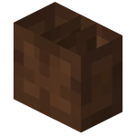
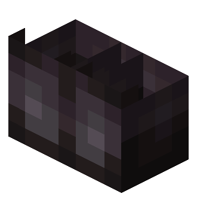

# 👞 Acrobacias

## » Habilidades


[rolar.md](rolar.md)



[esquivar.md](esquivar.md)


## » Técnicas

## » Tabela de EXP ganho

<table><thead><tr><th>» Ação «</th><th align="center">» EXP «</th><th data-hidden></th></tr></thead><tbody><tr><td> Ao cair</td><td align="center">600</td><td></td></tr><tr><td> Ao <a href="rolar.md">rolar</a></td><td align="center">600</td><td></td></tr><tr><td> Ao <a href="esquivar.md">esquivar</a> de um ataque</td><td align="center">800</td><td></td></tr></tbody></table>
