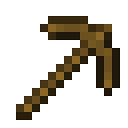
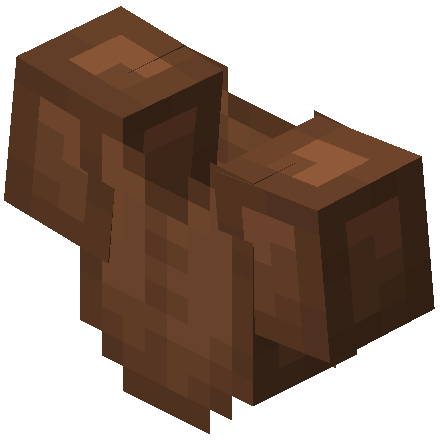
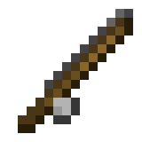
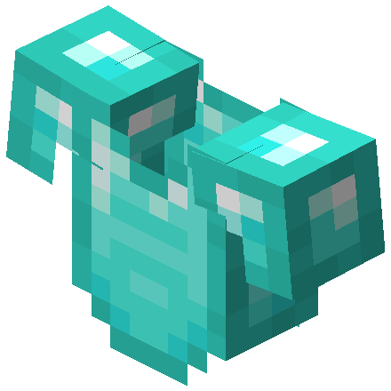
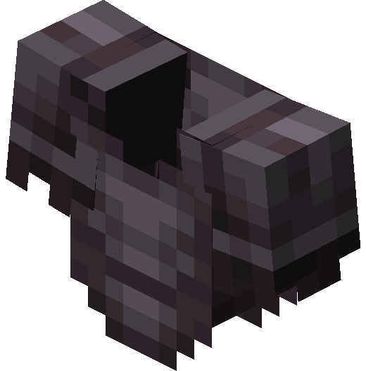
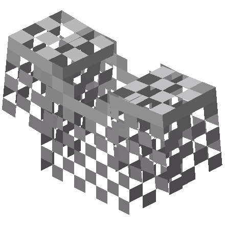

# 🕸 Reparação

## » Habilidades


[mestre-reparador.md](mestre-reparador.md)



[forja-arcana.md](forja-arcana.md)



[super-reparador.md](super-reparador.md)


## » Técnicas

## » Tabela de EXP ganho

<table><thead><tr><th>» Item Reparado «</th><th align="center">» EXP «</th><th data-hidden></th></tr></thead><tbody><tr><td> Item de Ouro</td><td align="center">300</td><td></td></tr><tr><td> Item de Madeira</td><td align="center">600</td><td></td></tr><tr><td> Item de Pedra</td><td align="center">1300</td><td></td></tr><tr><td> Item de Couro</td><td align="center">1600</td><td></td></tr><tr><td> Item de Linha</td><td align="center">1800</td><td></td></tr><tr><td> Item de Ferro</td><td align="center">2500</td><td></td></tr><tr><td> Item de Diamante</td><td align="center">5000</td><td></td></tr><tr><td> Item de Netherite</td><td align="center">6000</td><td></td></tr><tr><td> Outros Itens</td><td align="center">1500</td><td></td></tr></tbody></table>
