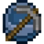
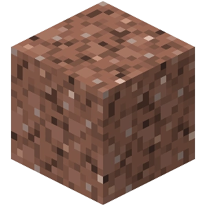
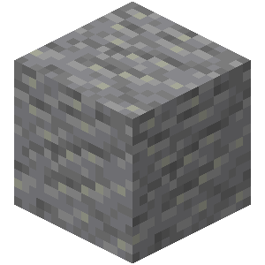
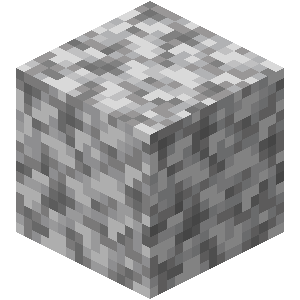
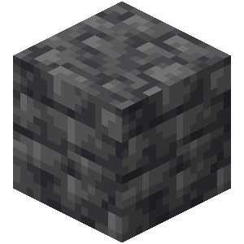

# ⛏ Mineração

**Mineração** é uma habilidade focada em mineração de pedra e minério. Uma vantagem notável dessa habilidade é o maior rendimento potencial de cada minério, aumentado ainda mais ao usar uma habilidade ativa. A mineração também adiciona novas funcionalidades ao TNT, permitindo a detonação remota. Mineração é uma habilidade pai de Fundição.

* [x] Ferramenta usada:  Picareta de qualquer material, Pederneira e  TNT.
* [x] Interage com: blocos mineráveis (minérios, pedra, granito, etc.).
* [x] Habilidades: _Ativas:_ Super Quebrador, Mineração Explosiva; _Passivas:_ Drops Duplos, Bombas Maiores, Experiente em Demolições.
* [x] Up ao quebrar minérios, pedras ou minerais.

## » Habilidades


[drops-duplos-de-minerios.md](drops-duplos-de-minerios.md)



[super-quebrador.md](super-quebrador.md)



[mineracao-explosiva.md](mineracao-explosiva.md)



[bombas-maiores.md](bombas-maiores.md)



[experiente-em-demolicoes.md](experiente-em-demolicoes.md)


## » Técnicas

### Uso

* Ao minerar, deixe quaisquer blocos de minério para trás e continue explorando. Quando a área estiver limpa e os minérios mais expostos, ative o super breaker para ter uma chance de drop triplo.

### Up - Dicas

* Colete todos os minérios que encontrar durante a mineração, incluindo carvão.
* Devido ao seu baixo valor de dureza, o netherrack está entre os blocos mais rápidos para minerar. Vá para o Nether com uma Eficiência II ou mais em uma Picareta de Diamante e minere Netherrack para up rápido, mas tenha cuidado com as poças de lava.
* O buff da Pressa II (obtido através de poção ou sinalizador), combinado com uma Picareta de Diamante Eficiência V, permite que a pedra seja quebrada instantaneamente. Ou, com uma Picareta Eficiência VI, adquirida na Caixa Comum, permite que quebre instantaneamente sem o uso do efeito de Pressa.
* Pedra do End dá a segunda maior EXP para blocos não-minérios. Mineração no Fim com uma picareta de eficiência é um método muito rápido para upar essa habilidade.
* Blocos de Cidade do End dão grandes quantidades de EXP (200-250) e podem ser extraídos instantaneamente com Pressa II e Eficiência V (ou Picareta Eficiência VI). Usar Elytra evitará quedas. Como as Cidades do Fim podem ser muito grandes, é uma maneira muito rápida de upar a Mineração.

## » Tabela de EXP ganho

| » Bloco «                                                                                                                       | » EXP « |   |
| ------------------------------------------------------------------------------------------------------------------------------- | :-----: | - |
|  Pedra                                                |    15   |   |
|  Granito                                    |    20   |   |
|  Andesito                                  |    20   |   |
|  Diorito                                            |    20   |   |
|  Minério de Carvão            |   400   |   |
|  Minério de Redstone                   |   600   |   |
|  Minério de Lapis Lazuli |   800   |   |
|  Minério de Ferro                          |   900   |   |
|  Minério de Esmeralda                   |   1000  |   |
|  Minério de Cobre                    |   1400  |   |
|  Minério de Diamante                    |   2400  |   |
|  Ardósia                             |    30   |   |
|  Pedregulho de Ardósia            |    30   |   |
|  Minério de Ardósia de Carvão    |   1300  |   |
