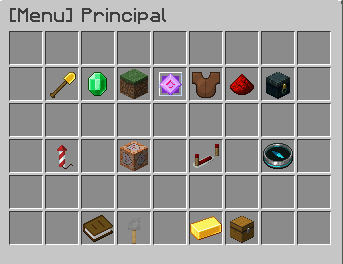

# 🤖 Ajuda e Comandos

<figure><figcaption></figcaption></figure>

### 1. Iniciando sua jornada

* Descrição: Primeiros passos essenciais para começar sua aventura no servidor.
* Passo a Passo:
  * Escolha seu mundo em `/mundos`.
  * Teleporte aleatório com `/livre`.
  * Atenção: Salve o local com `/sethome` e volte quando quiser com `/home`.
  * Teleporte aos amigos com `/tpa`.
  * Crie uma proteção com `/kit terreno` e adicione amigos com `/terreno confiar`.
  * Dica: Esqueceu o sethome? Use `/terreno lista`.

***

### 2. Como evoluir

* Descrição: O foco principal para crescer no servidor são os Coins, a principal moeda de troca.
* Como conseguir coins:
  * Produza recursos para a `/warp loja` (Plantações, Minérios, Drops e mais).
  * Venda itens em lojas de jogadores com `/pwarp`.
  * Utilize o mercado virtual através do comando `/mercado`.
  * Participe e vença eventos agendados ou automáticos.

***

### 3. Warps e Mundos

* Descrição: Menu principal para acessar todos os locais e mundos disponíveis no servidor.
* Comando: `/warps`
* Sistema de Retorno: Sempre que deslogar, você retornará à cidade principal. Utilize `/mundos` para voltar à última posição ou use os comandos rápidos `/verde`, `/vermelho` e `/azul`.

***

### 4. Temporadas

* Descrição: Entenda como funciona o ciclo do servidor, o sistema de ligas e o passe de batalha.
* Dúvidas Frequentes:
  * O que muda na troca de temporada?
  * Como ganhar R$ através da liga?
  * Importante: O servidor não reseta na troca de temporada.

***

### 5. Kits

* Descrição: Menu centralizado para resgate de kits diários, semanais ou de terrenos.
* Comando: `/kit`

***

### 6. Limites

* Descrição: Informações sobre os padrões técnicos seguidos para garantir a melhor estabilidade e jogabilidade para todos.
* Comando: `/limites`

***

### 7. Caixas Misteriosas

* Descrição: Teste sua sorte abrindo caixas para desbloquear recompensas exclusivas e itens raros.
* Como obter chaves:
  * Votando no servidor com `/votar`.
  * Negociando diretamente com outros jogadores.
  * Comprando através da `/cash shop`.
  * Mantendo-se conectado no Lago ou participando de eventos.
* Comando: `/caixas` (Teleporta para o local das caixas).

***

### 8. Eventos

* Descrição: Informações sobre eventos semanais como Guerra, Killer e eventos automáticos.
* Ao abater a Pinhata, existe a chance de iniciar uma votação para um evento automático.
* Comando: `/evento`

***

### 9. Preferências

* Descrição: Painel de configurações pessoais para ajustar sua experiência de jogo de acordo com seu gosto.
* Comando: `/pref`

***

### 10. Regras

* Descrição: Leia atentamente as normas do servidor para manter a boa convivência e evitar punições.
* Comando: `/regras`

***

### 11. Votar

* Descrição: Ajude o servidor a crescer na comunidade e receba recompensas exclusivas por cada voto.
* Recompensas:
  * Individual (por site): 1x Chave M. \[Comum] + 1x VotePoint (use em `/voteshop`).
  * Global (Meta de 75 votos): Surgimento da Pinhata através do comando `/pinhata`.
* Comando: `/votar` (Recebe os links no chat).

***

### 12. Correio

* Descrição: Local de entrega e resgate de recompensas acumuladas de caixas, chaves e eventos.
* Comando: `/correio`

## Ajuda avançada.

Um menu com funções mais avançadas do servidor com intuito de sanar todo tipo de dúvidas relacionado a sistemas do servidor.&#x20;

### 13. Guardião

* Descrição: Sistema inteligente de anti-trapaça automático.
* Avisos: Não force élitros bugadas e não altere seus clicks (debounce).
* Punições: 1º Ban (15 dias), 2º Ban (30 dias), 3º Ban (45 dias).

***

### 14. Pinhata

* Descrição: Mob festivo que surge no spawn a cada 100 votos.
* Super Pinhata: Evento agendado com chance de VIP e 3x mcMMO.
* Importante: Você precisa ter votado para conseguir bater na Pinhata.

***

### 15. mcMMO

* Descrição: Sistema de habilidades por níveis.
* Categorias:
  * Coleta: Escavação, Pesca, Herbalismo, Mineração, Lenhador.
  * Combate: Arquearia, Machados, Bestas, Espadas, Adestramento, etc.
  * Diversas: Acrobacias, Alquimia, Reparação, Fundição.

***

### 16. Clans

* Descrição: Crie grupos com amigos para cumprir objetivos.
* Custo: 250.000 coins para criar.
* Comando: `/clan`.

***

### 17. Liga

* Descrição: Competição mensal e de temporada pelo topo do ranking.
* Prêmios Mensais: Coins, Cash, TAG Especial e porcentagem da taxa do Mercado.
* Prêmios Temporada: Troféu e prêmios em Cash ou dinheiro real (até R$ 300,00 para o TOP 1).
* Comando: `/liga`.

***

### 18. Torneios

* Descrição: Disputas semanais valendo recompensas.
* Comando: `/hall`.

***

### 19. Tops

* Descrição: Jogadores destaque recebem ícones e tags exclusivas.
* Comando: `/hall`.

***

### 20. Loja Pessoal

* Descrição: Crie sua loja em baús.
* Como fazer: Segure o item, agache e hite o baú.
* Comando: `/pshop`.

***

### 21. Warp Pessoal

* Descrição: Crie pontos de teleporte públicos para sua loja ou clan.
* Custo: $25.000.
* Comando: `/pwarp`.

***

### 22. Silk Spawner

* Descrição: Chance de coletar spawners com picareta de diamante e Toque Suave.
* Chances por Cargo: Membro (15%), Super (30%), Ultra (40%), Legend (50%), Especial (75%).
* Bônus: Toque Suave II adiciona +25% de chance.
* Comando: `/silk`.

***

### 23. Skins

* Descrição: Altere sua aparência via biblioteca ou URL.
* Tutorial URL: Upe no Imgur, copie o endereço da imagem (.png) e use `/skin url <link>`.
* Comando: `/skin`.

***

### 24. Leilões

* Descrição: Disputa por itens valiosos via Discord.
* Altar da Fortuna: Itens raros (mcMMO, etc) disputados em Cash na `/warp altar`.
* Comando: `/warp leilao`.

***

### 25. Conquistas

* Descrição: Explore e libere recompensas.
* Recompensas: Luneta do Conquistador, TAG Conquistador e prêmios individuais.
* Comando: `/conquistas`.

***

### 26. Elevadores

* Descrição: Suba e desça andares de forma prática.
* Como criar: Posicione um bloco de minério e outro na mesma direção vertical (Y) a no máximo 50 blocos. Agache/pule para usar.

***

### 27. Pets

* Descrição: Companheiros cosméticos.
* Como obter: Eventos, Caixas Misteriosas ou Passe de Batalha.
* Comando: `/pets`.

***

### 28. Efeitos

* Descrição: Partículas cosméticas obtidas no Passe de Batalha.
* Comando: `/efeitos`.

***

### 29. Tags

* Descrição: Palavras de destaque no chat ao lado do nick.
* Info: Juntar todas as tags de uma categoria desbloqueia recompensas extras.
* Comando: `/tags`.

***

### 30. Aviso de Login

* Descrição: Mensagem de entrada personalizada no servidor.
* Como obter: Liberando categorias de tags, sendo o MITO ou TOP 1 de um ranking.

***

### 31. Coinflip

* Descrição: Apostas de cara ou coroa contra outros jogadores.
* Taxa: 5% de manutenção. Uso exclusivo no `/spawn`.
* Comando: `/cf`.

***

### 32. Mapart

* Descrição: Crie artes em mapas e proteja-as.
* Custo: $10.000 para travar o mapa com `/copyright`.
* Dica: Utilize Litematica para ajudar na criação.

***

### 33. Sentar&#x20;

* Descrição: Interações corporais para socializar.
* Comandos: `/sentar`, `/deitar`, `/nadar`, `/rastejar`, `/girar`.

***

### 34. Lago do Sapo

* Descrição: Ganhe recompensas nadando no lago mágico a cada 30 minutos.
* Prêmios: Coins (até 10k), Chaves, Pontos no Passe, XP e Cash.
* Comando: `/warp lago`.

***

### 35. Mito do PvP

* Descrição: Jogador de maior destaque em combate.
* Como obter: Seja o matador na Guerra ou mate o Mito atual.
* Restrição: TAG inegociável; repassa automático após 12h de inatividade.
* Comando: `/mito`.

***

### 36. Contadores&#x20;

* Descrição: Contabilize suas ações (quebras, abates) diretamente nos itens.
* Comando: `/contadores`.

***

### 37. Moldura Invisível

* Descrição: Torne suas molduras invisíveis usando o Transformador de Molduras.
* Limite: 32 usos por item. Adquira na `/cash shop`.

***

### 38. Editor de Suporte de Armaduras

* Descrição: Ferramenta para editar poses e características de Armor Stands.
* Info: Item de uso exclusivo VIP.

***

### 39. Duel

* Descrição: Desafie jogadores para combate individual no `/spawn`.
* Comando: `/duel`.

***

### 40. Casamento

* Descrição: Jure amor eterno no servidor.
* Custo: $25.000 (cada).
* Benefícios: Teleporte sem aceitar, Chat Privado e Home em comum.
* Comando: `/marry`.

***

### 41. Assinatura

* Descrição: Deixe sua marca em placas pelo mundo. Efeitos variam por cargo.
* Comando: `/assinar` (mirando na placa).

***

### 42. Mortes

* Descrição: Veja seu histórico e informações de morte.
* Bônus: Jogadores VIP podem usar `/back` para retornar ao local.
* Comando: `/mortes`.

***

### 43. Mercado

* Descrição: Compre e venda itens de forma virtual.
* Taxa: 5% (Cargos Especiais são isentos). Itens expiram em 2 dias.
* Comando: `/mercado`.

***

### 44. Trocar

* Descrição: Sistema de trocas seguro entre dois jogadores.
* Comando: `/trocar`.

***

### 45. Boosters

* Descrição: Acelere sua evolução (XP, Skills, etc).
* Comando: `/booster`.

