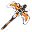

# Picareta Explosiva

##  Introdução

A Picareta Explosiva é uma ferramenta especial com a capacidade de quebrar vários blocos ao mesmo tempo, sua característica que difere das outras é o nome logo abaixo dos encantamentos chamado Explosão, disponíveis nos níveis Ⅰ, Ⅱ e Ⅲ.&#x20;

Esse item ficou disponível durante a Caixa Halloween  2024, sendo que era possível encontrar na caixa ou trocando cxp por ela. Os níveis eram sorteados de forma aleatória.

## Funcionamento

Ao quebrar um bloco com essa ferramenta, a explosão destrói também os blocos ao redor em uma área determinada pelo nível da explosão escrita na ferramenta.&#x20;

A área é representada no formato, **largura** x **altura** x **profundidade**.

<table><thead><tr><th width="159.6666259765625">Nível</th><th width="112.6666259765625" align="center">Área</th><th width="99.666748046875" data-type="number">Blocos</th></tr></thead><tbody><tr><td>Explosão I</td><td align="center">3 x 3 x 1</td><td>9</td></tr><tr><td>Explosão II</td><td align="center">3 x 3 x 2</td><td>18</td></tr><tr><td>Explosão III</td><td align="center">3 x 3 x 3 </td><td>27</td></tr></tbody></table>

Não existe uma limitação específica de blocos que a explosão é aplicada, ou seja, qualquer bloco pode ser minerado pelo Picareta Explosiva e ser afetado pela explosão.&#x20;


Dependendo da velocidade com que os blocos são quebrados, alguns blocos dentro da área podem eventualmente não serem destruídos.&#x20;


Fora a explosão causada, a picareta funciona como uma picareta normal do Minecraft.

## Encantamentos

As picaretas explosivas possuem encantamentos como qualquer outro item, podendo existir originalmente com os encantamentos.

<table><thead><tr><th width="155.3333740234375">Encantamento</th><th width="144.6666259765625">Nível</th></tr></thead><tbody><tr><td>Eficiência</td><td>VI</td></tr><tr><td>Fortuna</td><td>IV ou V</td></tr><tr><td>Durabilidade</td><td>V ou IV</td></tr><tr><td>Remendo</td><td>I</td></tr></tbody></table>

Os níveis de Fortuna e Durabilidade podem variar entre as diferentes versões do item.

### Remoção de encantamentos

Os encantamentos originais dos itens podem ser removidos utilizando o rebolo, assim como em um item vanilla.

Ao remover os encantamentos a função de Explosão não perderá seu efeito.


### **NÃO É RECOMENDADO REMOVER FORTUNA DA PICARETA EXPLOSIVA**

Os drops duplos e/ou triplos do McMMO são contabilizados apenas no bloco alvo, ou seja, no bloco quebrado diretamente pelo jogador, os outros blocos quebrados pela explosão do item não recebem esse benefício do McMMO.



Fortuna é aplicada normalmente a todos os blocos quebrados pela Explosão do item.


## Descrição

A descrição ou lore do item identifica o nível de explosão e o jogador que recebeu ela da caixa. Além disso, é pela descrição que você consegue validar se o item de fato é uma Picareta Explosiva.

Explosão <mark style="color:orange;">I</mark>-<mark style="color:orange;">II</mark>-<mark style="color:orange;">III</mark>

<mark style="color:red;">Item especial Halloween 2024</mark>

<mark style="color:orange;">👑</mark> Nick do jogador

Raridade: <mark style="color:orange;">✦✦✦✦✦</mark>

## Obtenção

A Picareta Explosiva foi disponibilizada durante a Caixa de Halloween de 2024, atualmente o item não pode mais ser obtido oficialmente pelo servidor.

Esse item ainda está circulando pelo servidor, sendo possível obter ela com outros jogadores.&#x20;


Por ser um item limitado e serem itens dos jogadores, o valor do item precisa ser negociado diretamente entre os jogadores. O servidor ou a staff não interfere nisso.


