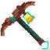

# Picareta Natalina

## &#x20; Introdução

A Picareta Natalina é uma ferramenta especial disponibilizada durante o evento de Natal 2024, ela possui duas variações, diferenciadas pelo nível de encantamento Toque Suave, sendo nivel 1 e nível 2.

A versão com Toque Suave Ⅰ funciona como uma picareta comum, sem nenhuma habilidade adicional.

A versão com Toque Suave ⅠⅠ possui efeitos especiais relacionados a quebra de spawners e McMMO.

É importante ressaltar que o encantamento Toque Suave ⅠⅠ é exclusivo da Picareta Natalina 2024, não podendo ser encontrado em livros ou em outras ferramentas.

## Toque Suave ⅠⅠ

A habilidade do Toque Suave ⅠⅠ funciona de forma passiva, sem a necessidade de comandos ou ativações, basta usar a ferramenta normalmente para que seus efeitos sejam aplicados.

Esse encantamento adiciona 25 pontos percentuais à chance de remover um spawner e ele dropar.

A chance final depende do vip do jogador:

<table><thead><tr><th width="137.6666259765625">Vip</th><th width="180.333251953125">Chance Padrão</th><th width="188.6666259765625">Com Toque Suave ⅠⅠ</th></tr></thead><tbody><tr><td>Especial</td><td>75%</td><td>100%</td></tr><tr><td>Legend</td><td>50%</td><td>75%</td></tr><tr><td>Ultra </td><td>40%</td><td>65%</td></tr><tr><td>Super</td><td>30%</td><td>55%</td></tr><tr><td>Sem vip</td><td>15%</td><td>40%</td></tr></tbody></table>

Por exemplo, se o jogador VIP Legend possui normalmente 50% de chance, utilizando a Picareta Natalina Toque Suave ⅠⅠ, essa chance passa para 75%.

## McMMO

A Picareta Natalina com Toque Suave ⅠⅠ também possui uma bonificação de 25% a mais na chance de ocorrer o drop triplo do McMMO.

Por exemplo, se sua chance de obter drops triplos for de 40%, a chance passa a ser de 50%.

Você pode consultar sua chance atual em <kbd>/mineração</kbd> , em Veio Rico.

## Encantamentos

Todas as picaretas Natalinas possuem originalmente os seguintes encantamentos:

<table><thead><tr><th width="150.9998779296875">Encantamento</th><th width="109.6666259765625">Nível</th></tr></thead><tbody><tr><td>Eficiência</td><td>VI</td></tr><tr><td>Durabilidade </td><td>V</td></tr><tr><td>Remendo</td><td>I</td></tr><tr><td>Toque Suave</td><td>I ou II</td></tr></tbody></table>

A única variação entre as unidades do item é o nível do Toque Suave, que era definido aleatoriamente no momento da obtenção.

### Remoção dos encantamentos

Os encantamentos da Picareta Natalina podem ser removidos normalmente utilizando um rebolo, mas caso a picareta possua o Toque Suave II, remover ele também fará com que ela perca completamente suas habilidades especiais. Isso acontece porque os efeitos são do Toque Suave II, após a remoção, a picareta passará a funcionar como uma ferramenta normal.


### ATENÇÃO

O encantamento Toque Suave II não pode ser obtido através de livros encontrado ou encontrados normalmente em outras ferramentas. Tenha cuidado ao utilizar um rebolo ou bigorna McMMO em uma picareta que possua esse encantamento.&#x20;


## Obtenção

A Picareta Natalina foi disponibilizada durante o evento de Natal de 2024, podendo ser obtida através da caixa Natalina ou do CXP.

Ao conseguir o item, sua versão era definida aleatoriamente, podendo vir com Toque Suave I ou Toque Suave II.

Com o encerramento do evento natalino 2024 e da disponibilidade da caixa, a Picareta Natalina deixou de ser obtida oficialmente através do servidor.

Atualmente, ainda é possível adquirir o item através de negociações com outros jogadores.


Por ser um item limitado e serem itens dos jogadores, o valor do item precisa ser negociado diretamente entre os jogadores. O servidor ou a staff não interfere nisso.

