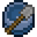

# 🏺 Escavação

**Escavação** é uma habilidade baseada na quebra de blocos escaváveis.&#x20;

## Habilidades


[arqueologia.md](arqueologia.md)



[super-broca.md](super-broca.md)


## Técnicas

**Para ganhar XP nesta habilidade**, é necessário cavar com uma pá na mão. Apenas alguns materiais podem ser escavados para obter tesouros e XP.

**Materiais compatíveis logo abaixo junto da tabela de XP de cada bloco.**

## &#x20;Tabela de EXP ganho

| Bloco                       | Valor |
| --------------------------- | ----- |
| Neve                        | 2.0   |
| Argila                      | 4.0   |
| Terra                       | 4.0   |
| Terra Grossa                | 4.0   |
| Podzol                      | 4.0   |
| Bloco de Grama              | 4.0   |
| Cascalho                    | 4.0   |
| Micélio                     | 4.0   |
| Areia                       | 4.0   |
| Areia Vermelha              | 4.0   |
| Bloco de Neve               | 4.0   |
| Areia das Almas             | 4.0   |
| Solo de Almas               | 4.0   |
| Terra Enraizada             | 6.0   |
| Lama                        | 8.0   |
| Raízes de Mangue Lamacentas | 9.0   |


EXP ganho apenas em blocos gerados naturalmente.

