# 🏺 Escavação

**Escavação** é uma habilidade baseada na quebra de blocos escaváveis.&#x20;

## » Habilidades


[arqueologia.md](../../../../global/mcmmo/habilidades-de-coleta/escavacao/arqueologia.md)



[super-broca.md](../../../../global/mcmmo/habilidades-de-coleta/escavacao/super-broca.md)


## » Técnicas

## » Tabela de EXP ganho


EXP ganho apenas em blocos gerados naturalmente.


<table><thead><tr><th>» Blocos «</th><th align="center">» EXP «</th><th data-hidden></th></tr></thead><tbody><tr><td>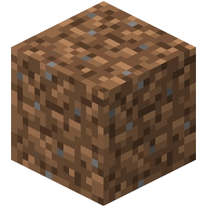 Terra</td><td align="center">40</td><td></td></tr><tr><td>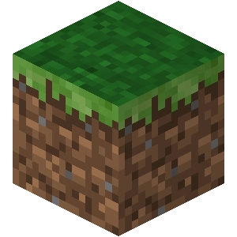 Bloco de Grama</td><td align="center">40</td><td></td></tr><tr><td>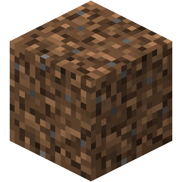 Terra Grossa</td><td align="center">40</td><td></td></tr><tr><td>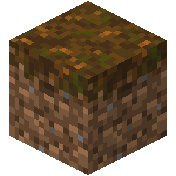 Podzol</td><td align="center">40</td><td></td></tr><tr><td>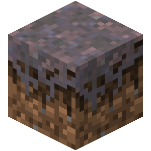 Micélio</td><td align="center">40</td><td></td></tr><tr><td>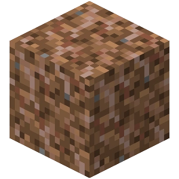 Terra Enraizada</td><td align="center">60</td><td></td></tr><tr><td>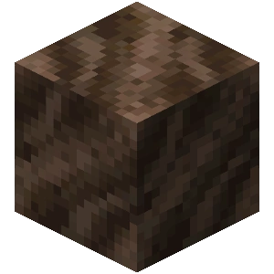 Terra das Almas</td><td align="center">70</td><td></td></tr><tr><td>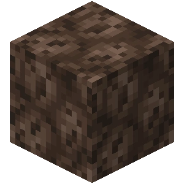 Areia das Almas</td><td align="center">70</td><td></td></tr><tr><td> Areia</td><td align="center">40</td><td></td></tr><tr><td>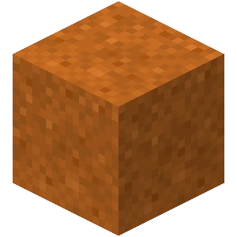 Areia Vermelha</td><td align="center">40</td><td></td></tr><tr><td>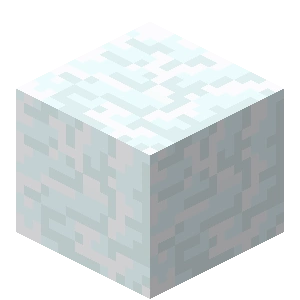 Bloco de Neve</td><td align="center">40</td><td></td></tr><tr><td>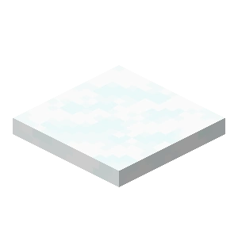 Neve</td><td align="center">20</td><td></td></tr><tr><td> Cascalho</td><td align="center">40</td><td></td></tr><tr><td>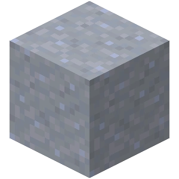 Argila</td><td align="center">40</td><td></td></tr></tbody></table>
