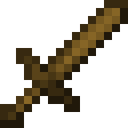

# 🌾 Herbalismo

Herbalismo é uma habilidade no McMMO que governa a capacidade de colher plantas e culturas, excluindo árvores e outras ocorrências mais estruturais de plantas. Requer várias ferramentas para fazer o uso completo de suas habilidades.

* [x] Ferramentas usadas:  Enxada (para a habilidade [Terra Verde](broken-reference)),  Espada (para a habilidade [Sorte de Hylian](broken-reference)) e mão.
* [x] Habilidades: _Ativas:_ Terra Verde, Polegar Cogumelo; _Passivas:_ Polegar Verde, Dieta de Fazendeiro, Sorte de Hylian, Drops Duplos.
* [x] Interage com:  Pedregulho,  Tijolos de Pedra,  Terra e  Plantações em um geral.
* [x] Up ao quebrar plantações com enxada.

## » Habilidades


[terra-verde.md](terra-verde.md)



[polegar-verde.md](polegar-verde.md)



[polegar-cogumelo.md](polegar-cogumelo.md)



[dieta-do-fazendeiro.md](dieta-do-fazendeiro.md)



[sorte-de-hylian.md](sorte-de-hylian.md)



[drops-duplos-de-plantacoes.md](drops-duplos-de-plantacoes.md)



[drops-triplos-de-plantacoes.md](drops-triplos-de-plantacoes.md)


## » Técnicas

**Cana-de-açúcar:** Uma fazenda ideal é modelada para maximizar a eficiência do espaço. Uma fazenda grande o suficiente pode ser colhida sem parar. A cana-de-açúcar pode crescer até três blocos de altura, e quebrar o meio de um caule adulto rende 60 anos de exp total. Além de dar uma boa taxa de EXP e não precisar replantar, rende uma boa quantidade de dinheiro.

* Prós: Sem replantio, não precisa de luz
* Contras: A cana-de-açúcar requer água próxima ao bloco em que é plantada, tornando-a menos eficiente em termos de espaço do que outras culturas. Cresce em um ritmo bastante lento. Exigir espaço massivo para otimização.

**Fungo do Nether:**

* Prós: A taxa de crescimento mais rápida entre todas as culturas sem água ou luz.
* Contras: Para plantar é necessário Areia das Almas para plantar. A velocidade de caminhada lenta na Areia das Almas também pode impedir a colheita e o replantio, a menos que você tenha o encantamento Soul Speed.

**Trigo/Cenoura/Batata/Beterraba**:

* Prós: Muito eficiente em termos de espaço, pode ser construído verticalmente. Condições ideais exigem apenas um bloco de água para cada área de fazenda 9x9. O up nessas plantações quando você estiver acima dos 1000 níveis de Herbalismo, é a melhor opção pois, com a colheita com uma enxada, a fazenda é 100% replantada automaticamente.
* Contras: Requer manutenção pesada e não oferece vantagens de velocidade em comparação com outros métodos baseados em fazendas. Não pode ser automatizado, e a fazenda deve ser totalmente crescida a cada colheita para ganhar a quantidade máxima de pontos de habilidade, perdendo tempo se alguém microgerencia sua fazenda ou não.

**Melancia/Abóbora:**

* Prós: Não é necessário o replantio, em plantações grandes o tempo-benefício é o melhor.
* Contras: O espaço usado para a plantação é maior do que uma de trigo ou cenoura, mas, a não necessariedade de replantio compensa isto.

## » Tabela de EXP ganho

| Bloco                                  | Valor |
| -------------------------------------- | ----- |
| Planta de Coro                         | 1     |
| Bloco de Verruga do Nether             | 3     |
| Bloco de fungo destorcido              | 3     |
| Vinhas da Caverna                      | 5     |
| Planta de Vinhas da Caverna            | 5     |
| Alga                                   | 5     |
| Planta de Alga                         | 5     |
| Líquen Luminoso                        | 5     |
| Raízes Carmesim                        | 6     |
| Raízes Distorcidas                     | 6     |
| Brotos do Nether                       | 10    |
| Pétalas Cor-de-rosa                    | 10    |
| Erva Marinha                           | 10    |
| Erva Marinha Alta                      | 10    |
| Samambaia                              | 10    |
| Grama                                  | 10    |
| Grama Baixa                            | 10    |
| Bambu                                  | 10    |
| Bloco de Musgo Pálido                  | 10    |
| Carpete de Musgo Pálido                | 10    |
| Coral Tubo Morto                       | 10    |
| Coral Cérebro Morto                    | 10    |
| Coral Bolha Morto                      | 10    |
| Coral Fogo Morto                       | 10    |
| Coral Chifre Morto                     | 10    |
| Leque de Coral Tubo Morto              | 10    |
| Leque de Coral Cérebro Morto           | 10    |
| Leque de Coral Bolha Morto             | 10    |
| Leque de Coral Fogo Morto              | 10    |
| Leque de Coral Chifre Morto            | 10    |
| Leque de Coral Tubo Morto na Parede    | 10    |
| Leque de Coral Cérebro Morto na Parede | 10    |
| Leque de Coral Bolha Morto na Parede   | 10    |
| Leque de Coral Fogo Morto na Parede    | 10    |
| Leque de Coral Chifre Morto na Parede  | 10    |
| Cogumelo Marrom                        | 15    |
| Cogumelo Vermelho                      | 15    |
| Melancia                               | 20    |
| Abóbora                                | 20    |
| Flor de Coro                           | 25    |
| Cacto                                  | 30    |
| Cana-de-Açúcar                         | 30    |
| Cacau                                  | 30    |
| Arbusto Seco                           | 30    |
| Cenouras                               | 50    |
| Batatas                                | 50    |
| Trigo                                  | 50    |
| Beterrabas                             | 50    |
| Fungo do nether                        | 50    |
| Fungo Carmesim                         | 50    |
| Fungo Distorcido                       | 50    |
| Arbusto de Bagas Doces                 | 50    |
| Lilás                                  | 50    |
| Roseira                                | 50    |
| Girassol                               | 50    |
| Grama Alta                             | 50    |
| Samambaia Grande                       | 50    |
| Olhorquídea (Flor dos Olhos)           | 66    |
| Coral Bolha                            | 75    |
| Leque de Coral Bolha                   | 75    |
| Leque de Coral Bolha na Parede         | 75    |
| Coral Tubo                             | 80    |
| Leque de Coral Tubo                    | 80    |
| Leque de Coral Tubo na Parede          | 80    |
| Coral Cérebro                          | 90    |
| Leque de Coral Cérebro                 | 90    |
| Leque de Coral Cérebro na Parede       | 90    |
| Plantocha (Flor da Tocha)              | 90    |
| Vitória-régia                          | 100   |
| Peônia                                 | 100   |
| Papoula                                | 100   |
| Dente-de-leão                          | 100   |
| Pequena Goteira                        | 140   |
| Grande Goteira                         | 140   |
| Coral Fogo                             | 120   |
| Leque de Coral Fogo                    | 120   |
| Leque de Coral Fogo na Parede          | 120   |
| Tulipa Branca                          | 150   |
| Botão Azul                             | 150   |
| Orquídea Azul                          | 150   |
| Tulipa Laranja                         | 150   |
| Margarida                              | 150   |
| Tulipa Rosa                            | 150   |
| Tulipa Vermelha                        | 150   |
| Centáurea Azul                         | 150   |
| Lírio-do-vale                          | 150   |
| Bloco de Musgo                         | 150   |
| Coral Chifre                           | 175   |
| Leque de Coral Chifre                  | 175   |
| Leque de Coral Chifre na Parede        | 175   |
| Planta Jarro                           | 160   |
| Ninho de Abelha                        | 200   |
| Cogubrilho                             | 250   |
| Rosa do Wither                         | 500   |


EXP ganho apenas em blocos (plantações) no estágio máximo (se tiver) e se for bloco (plantação) não colocada por um jogador (quando a plantação muda de estágio de crescimento, muda essa estatística).

