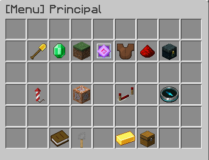

# ⛏️ Mineração

**Mineração** é uma habilidade focada em mineração de pedra e minério. Uma vantagem notável dessa habilidade é o maior rendimento potencial de cada minério, aumentado ainda mais ao usar uma habilidade ativa. A mineração também adiciona novas funcionalidades ao TNT, permitindo a detonação remota. Mineração é uma habilidade pai de Fundição.

* [x] Ferramenta usada:  Picareta de qualquer material, Pederneira e  TNT.
* [x] Interage com: blocos mineráveis (minérios, pedra, granito, etc.).
* [x] Habilidades: _Ativas:_ Super Quebrador, Mineração Explosiva; _Passivas:_ Drops Duplos, Bombas Maiores, Experiente em Demolições.
* [x] Up ao quebrar minérios, pedras ou minerais.

## Habilidades


[Broken link](broken-reference)



[super-quebrador.md](super-quebrador.md)



[mineracao-explosiva.md](mineracao-explosiva.md)



[bombas-maiores.md](bombas-maiores.md)



[experiente-em-demolicoes.md](experiente-em-demolicoes.md)


## Técnicas

### Uso

* Habilidade é evoluída com a quebra de blocos mineráveis, como pedra, arenito ou qualquer minério, por exemplo.&#x20;

### Up - Dicas

* Colete todos os minérios que encontrar durante a mineração, incluindo carvão.
* Ao minerar, deixe quaisquer blocos de minério para trás e continue explorando. Quando a área estiver limpa e os minérios mais expostos, ative o super breaker para ter uma chance de drop triplo.
* O buff da Pressa II (obtido através de poção ou sinalizador), combinado com uma Picareta de Diamante Eficiência V, permite que a pedra seja quebrada instantaneamente. Ou, com uma Picareta Eficiência VI, adquirida na Caixa Comum, permite que quebre instantaneamente sem o uso do efeito de Pressa.

## &#x20;Tabela de EXP ganho

| Bloco                                                                                         | Quantidade |
| --------------------------------------------------------------------------------------------- | ---------- |
|  Veias de Sculk      | 3          |
| .png>) Sculk                                        | 4          |
| .png>)Nicélio Distorcido                            | 5          |
| .png>)Nicélio Carmesim                              | 5          |
| .png>)  Sensor de Sculk                             | 6          |
| .png>)Catalisador de Sculk                          | 10         |
| .png>)Cristal Pequeno de Ametista                   | 10         |
| .png>)Tufo                                          | 10         |
| .png>) Emissor de Sculk                             | 12         |
| .png>)  Pedra do End                               | 15         |
| .png>)Pedra Luminosa                               | 15         |
| .png>)Pedregulho Musgoso                           | 15         |
| .png>)Netherrack                                   | 15         |
| .png>)Gelo Compactado                              | 15         |
| .png>)Gelo Azul                                    | 15         |
| .png>)Pedregulho                                   | 15         |
| .png>) Granito                                     | 15         |
| .png>)Andesito                                     | 15         |
| .png>) Diorito                                     | 15         |
| .png>)Pedregulho de Ardósia                        | 15         |
| .png>)Cristal Médio de Ametista                    | 20         |
| .png>)Ardósia                                      | 30         |
| .png>)Bloco de Magma                               | 30         |
| .png>)Terracota                                    | 30         |
| .png>)Arenito                                      | 30         |
|  Barro Seco | 30         |
| .png>)Cristal Grande de Ametista                   | 30         |
| .png>)Bloco de Espeleotema                         | 35         |
| .png>) Basalto                                     | 40         |
| .png>) Tijolos de Barro                            | 40         |
| .png>) Pedra-Negra                                 | 55         |
| .png>) Tijolos de Pedra                            | 50         |
| .png>) Tijolos de Pedra Rachados                   | 50         |
| .png>) Tijolos de Pedra Musgosos                   | 50         |
| .png>) Tijolos de Pedra Talhados                   | 50         |
| .png>) Tijolos do End                              | 50         |
| .png>) Tijolos do Nether                           | 50         |
| .png>) Tijolos do Nether Rachados                  | 50         |
| .png>) Tijolos do Nether Talhados                  | 50         |
| .png>) Tijolos do Nether Vermelhos                 | 50         |
| .png>) Terracota Preta                             | 50         |
| .png>)Terracota Azul (Todas variações de cores)    | 50         |
| .png>) Aglomerado de Ametista                      | 60         |
| .png>) Bloco de Coral-de-Bolha                     | 70         |
|  Prismarinho                                                                                  | 70         |
| Tijolos de Prismarinho                                                                        | 70         |
| Prismarinho Escuro                                                                            | 70         |
| Lanterna do Mar                                                                               | 70         |
| .png>) Bloco de Coral de Tubo                      | 75         |
| .png>) Bloco de Coral Cérebro                      | 80         |
| .png>) Bloco de Coral Fogo                         | 90         |
| .png>) Arenito Vermelho                            | 100        |
| Agregado de Ametista                                                                          | 125        |
| Bloco de Coral Chifre                                                                         | 125        |
| Bloco de Ametista                                                                             | 150        |
| Laje de Purpura                                                                               | 150        |
| Obsidiana                                                                                     | 150        |
| Bloco de Purpura                                                                              | 200        |
| Pedra-Negra Dourado                                                                           | 200        |
| Pilar de Purpura                                                                              | 250        |
| Escadas de Purpura                                                                            | 250        |
| Basalto Polido                                                                                | 300        |
| Minério de Quartzo do Nether                                                                  | 300        |
| Calcita                                                                                       | 400        |
| Minério de Carvão                                                                             | 400        |
| Bloco de Osso                                                                                 | 500        |
| Ardósia Reforçada                                                                             | 500        |
| Minério de Carvão da Ardósia                                                                  | 700        |
| Minério de Redstone                                                                           | 600        |
| Minério de Lápis Lazúli                                                                       | 800        |
| Minério de Redstone da Ardósia                                                                | 900        |
| Minério de Ferro                                                                              | 900        |
| Minério de Esmeralda                                                                          | 1000       |
| Minério de Ouro                                                                               | 1300       |
| Minério de Ouro do Nether                                                                     | 1300       |
| Minério de Ferro da Ardósia                                                                   | 1300       |
| Minério de Cobre                                                                              | 1400       |
| Minério de Lápis Lazúli da Ardósia                                                            | 1400       |
| Minério de Esmeralda da Ardósia                                                               | 1700       |
| Minério de Cobre da Ardósia                                                                   | 1900       |
| Minério de Ouro da Ardósia                                                                    | 1900       |
| Minério de Diamante                                                                           | 2400       |
| Obsidiana Chorosa                                                                             | 3000       |
| Minério de Diamante da Ardósia                                                                | 3600       |
| Detritos Antigos                                                                              | 7777       |


EXP ganho apenas por quebra de blocos gerados naturalmente!

