# ⛏ Mineração

**Mineração** é uma habilidade focada em mineração de pedra e minério. Uma vantagem notável dessa habilidade é o maior rendimento potencial de cada minério, aumentado ainda mais ao usar uma habilidade ativa. A mineração também adiciona novas funcionalidades ao TNT, permitindo a detonação remota. Mineração é uma habilidade pai de Fundição.

* [x] Ferramenta usada:  Picareta de qualquer material, Pederneira e  TNT.
* [x] Interage com: blocos mineráveis (minérios, pedra, granito, etc.).
* [x] Habilidades: _Ativas:_ Super Quebrador, Mineração Explosiva; _Passivas:_ Drops Duplos, Bombas Maiores, Experiente em Demolições.
* [x] Up ao quebrar minérios, pedras ou minerais.

## » Habilidades


[drops-duplos-de-minerios.md](../../../../global/mcmmo/habilidades-de-coleta/mineracao/drops-duplos-de-minerios.md)



[super-quebrador.md](../../../../global/mcmmo/habilidades-de-coleta/mineracao/super-quebrador.md)



[mineracao-explosiva.md](../../../../global/mcmmo/habilidades-de-coleta/mineracao/mineracao-explosiva.md)



[bombas-maiores.md](../../../../global/mcmmo/habilidades-de-coleta/mineracao/bombas-maiores.md)



[experiente-em-demolicoes.md](../../../../global/mcmmo/habilidades-de-coleta/mineracao/experiente-em-demolicoes.md)


## » Técnicas

### Uso

* Habilidade é evoluída com a quebra de blocos mineráveis, como pedra, arenito ou qualquer minério, por exemplo.&#x20;

### Up - Dicas

* Colete todos os minérios que encontrar durante a mineração, incluindo carvão.
* Ao minerar, deixe quaisquer blocos de minério para trás e continue explorando. Quando a área estiver limpa e os minérios mais expostos, ative o super breaker para ter uma chance de drop triplo.
* Devido ao seu baixo valor de dureza, o netherrack está entre os blocos mais rápidos para minerar. Vá para o Nether com uma Eficiência II ou mais em uma Picareta de Diamante e minere Netherrack para up rápido, mas tenha cuidado com as poças de lava.
* O buff da Pressa II (obtido através de poção ou sinalizador), combinado com uma Picareta de Diamante Eficiência V, permite que a pedra seja quebrada instantaneamente. Ou, com uma Picareta Eficiência VI, adquirida na Caixa Comum, permite que quebre instantaneamente sem o uso do efeito de Pressa.
* Pedra do End dá a segunda maior EXP para blocos não-minérios. Mineração no Fim com uma picareta de eficiência é um método muito rápido para upar essa habilidade.
* Blocos de Cidade do End dão grandes quantidades de EXP (200-250) e podem ser extraídos instantaneamente com Pressa II e Eficiência V (ou Picareta Eficiência VI). Usar Elytra evitará quedas. Como as Cidades do Fim podem ser muito grandes, é uma maneira muito rápida de upar a Mineração.

## » Tabela de EXP ganho


EXP ganho apenas por quebra de blocos gerados naturalmente!


<table><thead><tr><th>» Bloco «</th><th align="center">» EXP «</th><th data-hidden></th></tr></thead><tbody><tr><td> Pedra</td><td align="center">15</td><td></td></tr><tr><td> Granito</td><td align="center">20</td><td></td></tr><tr><td> Andesito</td><td align="center">20</td><td></td></tr><tr><td> Diorito</td><td align="center">20</td><td></td></tr><tr><td> Minério de Carvão</td><td align="center">400</td><td></td></tr><tr><td> Minério de Redstone</td><td align="center">600</td><td></td></tr><tr><td> Minério de Lapis Lazuli</td><td align="center">800</td><td></td></tr><tr><td> Minério de Ferro</td><td align="center">900</td><td></td></tr><tr><td> Minério de Esmeralda</td><td align="center">1000</td><td></td></tr><tr><td> Minério de Cobre</td><td align="center">1400</td><td></td></tr><tr><td> Minério de Diamante</td><td align="center">2400</td><td></td></tr><tr><td> Ardósia</td><td align="center">30</td><td></td></tr><tr><td> Pedregulho de Ardósia</td><td align="center">30</td><td></td></tr><tr><td> Minério de Ardósia de Carvão</td><td align="center">700</td><td></td></tr><tr><td> Minério de Ardósia de Redstone</td><td align="center">900</td><td></td></tr><tr><td> Minério de Ardósia de Ferro</td><td align="center">1300</td><td></td></tr><tr><td> Minério de Ardósia de Lápis Lazuli</td><td align="center">1400</td><td></td></tr><tr><td> Minério de Ardósia de Esmeralda</td><td align="center">1700</td><td></td></tr><tr><td> Minério de Ardósia de Ouro</td><td align="center">1900</td><td></td></tr><tr><td> Minério de Ardósia de Cobre</td><td align="center">1900</td><td></td></tr><tr><td> Minério de Ardósia de Diamante</td><td align="center">3600</td><td></td></tr><tr><td> Detritos Ancestrais</td><td align="center">7777</td><td></td></tr><tr><td>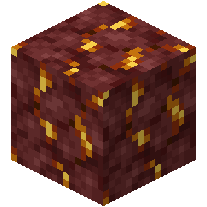 Minério de Ouro do Nether</td><td align="center">1300</td><td></td></tr><tr><td> Minério de Quartzo do Nether</td><td align="center">300</td><td></td></tr><tr><td>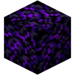 Obsidiana Chorona</td><td align="center">3000</td><td></td></tr><tr><td> Obsidiana</td><td align="center">150</td><td></td></tr><tr><td>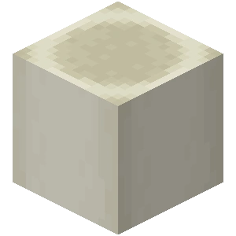 Bloco de Ossos</td><td align="center">500</td><td></td></tr><tr><td>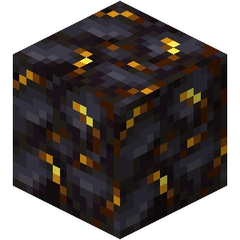 Pedra Negra Dourada</td><td align="center">200</td><td></td></tr><tr><td>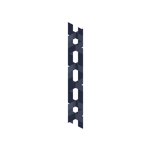 Corrente</td><td align="center">100</td><td></td></tr><tr><td>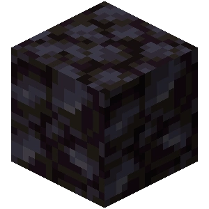 Pedra Negra</td><td align="center">55</td><td></td></tr><tr><td>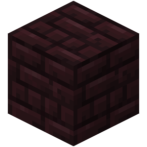 Tijolos do Nether (Todas Variações)</td><td align="center">50</td><td></td></tr><tr><td>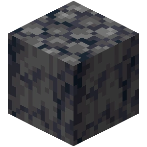 Basalto</td><td align="center">40</td><td></td></tr><tr><td> Bloco de Magma</td><td align="center">30</td><td></td></tr><tr><td>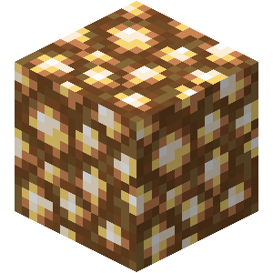 Pedra Luminosa</td><td align="center">15</td><td></td></tr><tr><td> Netherrack</td><td align="center">15</td><td></td></tr><tr><td>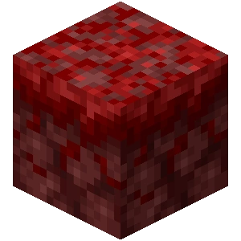 Nicélio Carmesim</td><td align="center">5</td><td></td></tr><tr><td>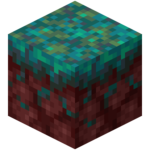 Nicélio Distorcido</td><td align="center">5</td><td></td></tr><tr><td>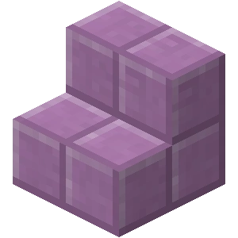 Escadas de Púrpura</td><td align="center">250</td><td></td></tr><tr><td>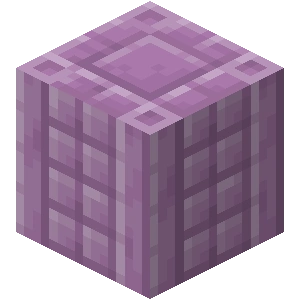 Pilar de Púrpura</td><td align="center">250</td><td></td></tr><tr><td> Bloco de Púrpura</td><td align="center">200</td><td></td></tr><tr><td> Laje de Púrpura</td><td align="center">150</td><td></td></tr><tr><td>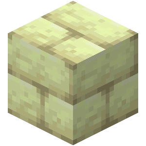 Tijolos de Pedra do Fim</td><td align="center">50</td><td></td></tr><tr><td>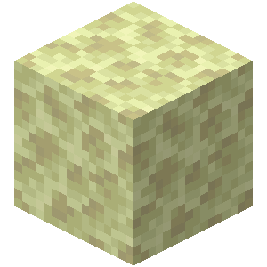 Pedra do Fim</td><td align="center">15</td><td></td></tr><tr><td>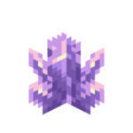 Aglomerado Grande de Ametista</td><td align="center">25</td><td></td></tr><tr><td>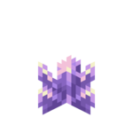 Cristal de Ametista Grande</td><td align="center">15</td><td></td></tr><tr><td>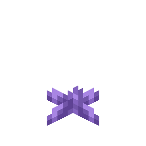 Cristal de Ametista Pequeno</td><td align="center">125</td><td></td></tr><tr><td>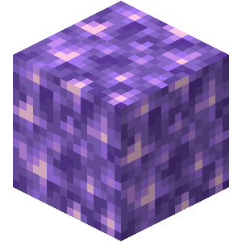 Bloco de Ametista</td><td align="center">150</td><td></td></tr><tr><td> Drusa de Ametista</td><td align="center">50</td><td></td></tr><tr><td> Calcita</td><td align="center">400</td><td></td></tr><tr><td>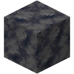 Basalto Liso</td><td align="center">300</td><td></td></tr><tr><td>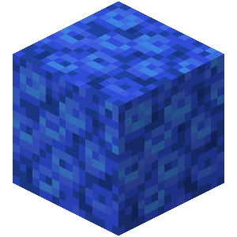 Bloco de Coral-de-Tubo</td><td align="center">75</td><td></td></tr><tr><td>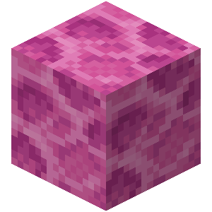 Bloco de Coral-de-Cérebro</td><td align="center">80</td><td></td></tr><tr><td>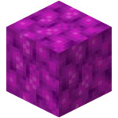 Bloco de Coral-de-Bolha</td><td align="center">70</td><td></td></tr><tr><td>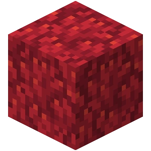 Bloco de Coral-de-Fogo</td><td align="center">90</td><td></td></tr><tr><td>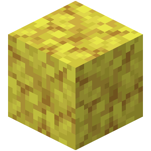 Bloco de Coral-de-Chifre</td><td align="center">125</td><td></td></tr><tr><td>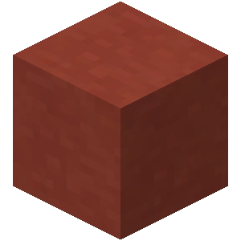 Terracota</td><td align="center">30</td><td></td></tr><tr><td>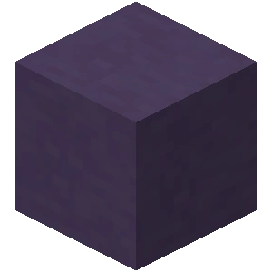 Terracota Colorida</td><td align="center">50</td><td></td></tr><tr><td>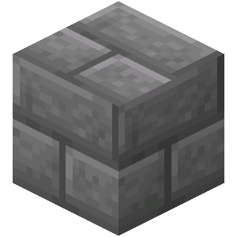 Tijolos de Pedra (Todas Variações)</td><td align="center">50</td><td></td></tr><tr><td>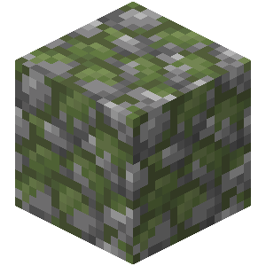 Pedregulho Musgoso</td><td align="center">30</td><td></td></tr><tr><td>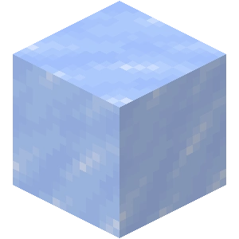 Gelo (Todas Variações)</td><td align="center">15</td><td></td></tr><tr><td>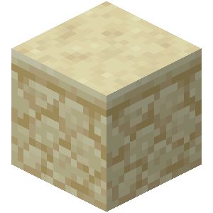 Arenito</td><td align="center">30</td><td></td></tr><tr><td>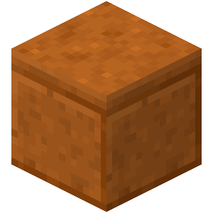 Arenito Vermelho</td><td align="center">100</td><td></td></tr><tr><td>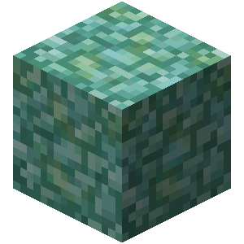 Prismarinho (Todas Variações)</td><td align="center">70</td><td></td></tr><tr><td>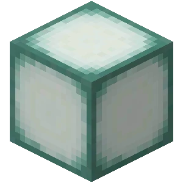 Lanterna do Mar</td><td align="center">70</td><td></td></tr><tr><td>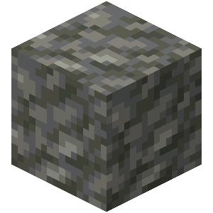 Tufo</td><td align="center">25</td><td></td></tr></tbody></table>
