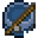
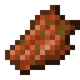
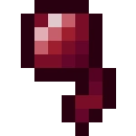
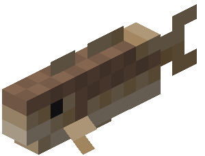
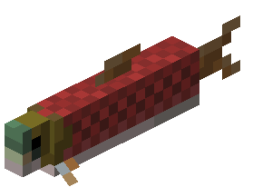
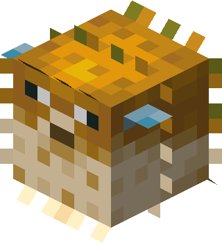
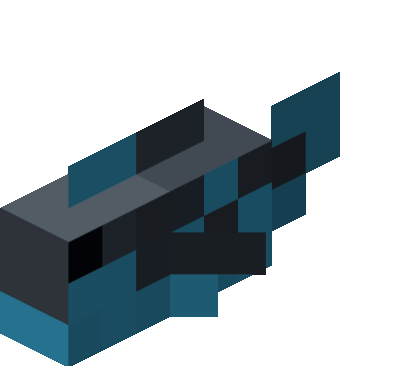

# 🎣 Pesca

## » Habilidades


[pescador-mestre.md](pescador-mestre.md)



[cacador-de-tesouros.md](cacador-de-tesouros.md)



[pesca-no-gelo.md](pesca-no-gelo.md)



[dieta-do-pescador.md](dieta-do-pescador.md)



[cacador-magico.md](cacador-magico.md)


## » Técnicas

## » Tabela de EXP ganho

<table><thead><tr><th>» Peixe Pescado «</th><th align="center">» EXP «</th><th data-hidden></th></tr></thead><tbody><tr><td> Qualquer item restante que não seja peixe</td><td align="center">3.75</td><td></td></tr><tr><td> Habilidade <a href="sacudir.md">Sacudir</a> utilizada em Mob</td><td align="center">3.75</td><td></td></tr><tr><td> Bacalhau</td><td align="center">7.5</td><td></td></tr><tr><td>🗝️ <a href="cacador-de-tesouros.md">Tesouros</a></td><td align="center">15</td><td></td></tr><tr><td> Salmão</td><td align="center">45</td><td></td></tr><tr><td> Baiacu</td><td align="center">100</td><td></td></tr><tr><td> Peixe Tropical</td><td align="center">750</td><td></td></tr></tbody></table>
