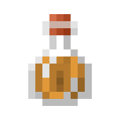
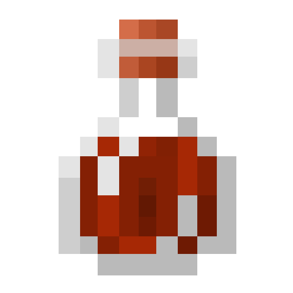

# 🪄 Alquimia

## » Habilidades


[catalise.md](catalise.md)



[misturas.md](misturas.md)


## » Poções que podem ser criadas.

| Nome da Poção                                                                | Efeito da Poção     | Ingrediente           | Nível de Desbloqueio | Tipo   | Informação                                                                |
| ---------------------------------------------------------------------------- | ------------------- | --------------------- | -------------------- | ------ | ------------------------------------------------------------------------- |
|  (1) (1).png>)Poção da Pressa      | Pressa              | Cenoura               | 100                  | Buff   | Aumenta a Velocidade de Mineração e Ataque                                |
|  (1).png>)Poção da Absorção        | Absorção            | Quartzo do Nether     | 200                  | Buff   | Aplica 2 corações adicionais (por nível) que desaparecem ao receber dano. |
| Poção da Fadiga de Mineração                                                 | Fadiga de Mineração | Bola de Slime         | 200                  | Debuff | Diminui a Velocidade de Mineração e Ataque                                |
|  (1).png>)Poção de Aumento de Vida | Aumento de Vida     | Maçã                  | 350                  | Buff   | Aplica 2 corações recarregáveis por nível                                 |
|  (1).png>)Poção da Fome            | Fome                | Carne Podre           | 350                  | Debuff | Diminui a barra de fome a uma taxa mais rápida                            |
|  (1).png>)Poção da Náusea          | Náusea              | Cogumelo Marrom       | 500                  | Debuff | Faz a visão do usuário girar (como ao entrar em um portal do Nether)      |
|  (1).png>)Poção da Cegueira        | Cegueira            | Saco de Tinta         | 500                  | Debuff | Diminui o alcance de visão do usuário e impede a corrida                  |
|  (1).png>)Poção da Saturação       | Saturação           | Samambaia             | 750                  | Buff   | Faz a barra de fome do usuário aumentar sem o consumo de comida.          |
|  (1).png>)Poção de Decomposição    | Decomposição        | Batata Venenosa       | 900                  | Debuff | Dano ao longo do tempo, muito parecido com queimadura ou veneno.          |
|  (1).png>)Poção da Resistência     | Resistência         | Maçã Dourada (normal) | 1000                 | Buff   | Aplica uma redução de dano de 20% por nível                               |

## » Tabela de EXP ganho


O EXP recebido não é definido pelo ingrediente usado, e sim pela quantidade de ingredientes usados para fazer a poção.


<table><thead><tr><th>» Poção «</th><th align="center">» EXP «</th><th data-hidden></th></tr></thead><tbody><tr><td> Poção de 1 ingrediente</td><td align="center">7.5</td><td></td></tr><tr><td> Poção de 2 ingredientes</td><td align="center">15</td><td></td></tr><tr><td> Poção de 3 ingredientes</td><td align="center">30</td><td></td></tr><tr><td> Poção de 4 ingredientes</td><td align="center">60</td><td></td></tr><tr><td> Poção de 5 ingredientes</td><td align="center">120</td><td></td></tr><tr><td> Poção de 6 ingredientes</td><td align="center">240</td><td></td></tr></tbody></table>
