# ⛓ Fundição

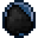

## » Habilidades


[Broken link](broken-reference)



[Broken link](broken-reference)



[Broken link](broken-reference)


## » Técnicas

## » Tabela de EXP ganho

<table><thead><tr><th>» Item fundido em fornalha «</th><th align="center">» EXP «</th><th data-hidden></th></tr></thead><tbody><tr><td>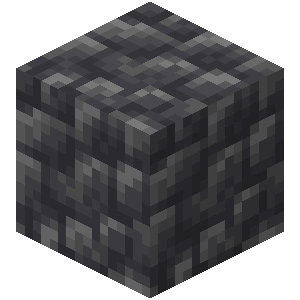 Pedregulho de Ardósia</td><td align="center">5</td><td></td></tr><tr><td>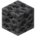 Minério de Carvão de Ardósia</td><td align="center">20</td><td></td></tr><tr><td> Minério de Carvão</td><td align="center">10</td><td></td></tr><tr><td>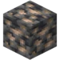 Minério de Ferro de Ardósia</td><td align="center">40</td><td></td></tr><tr><td>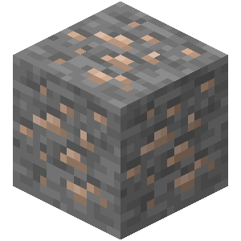 Minério de Ferro</td><td align="center">25</td><td></td></tr><tr><td>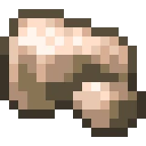 Ferro Bruto</td><td align="center">25</td><td></td></tr><tr><td>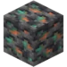 Minério de Cobre de Ardósia</td><td align="center">100</td><td></td></tr><tr><td> Minério de Cobre</td><td align="center">50</td><td></td></tr><tr><td>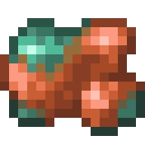 Cobre Bruto</td><td align="center">50</td><td></td></tr><tr><td>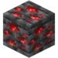 Minério de Redstone de Ardósia</td><td align="center">30</td><td></td></tr><tr><td> Minério de Redstone</td><td align="center">15</td><td></td></tr><tr><td>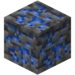 Minério de Lápis-Lazúli de Ardósia</td><td align="center">60</td><td></td></tr><tr><td> Minério de Lápis-Lazúli</td><td align="center">40</td><td></td></tr><tr><td> Minério de Ouro de Ardósia</td><td align="center">50</td><td></td></tr><tr><td>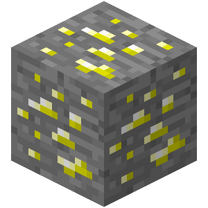 Minério de Ouro e Minério de Ouro do Nether</td><td align="center">35</td><td></td></tr><tr><td>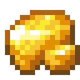 Ouro Bruto</td><td align="center">75</td><td></td></tr><tr><td> Minério de Diamante de Ardósia</td><td align="center">140</td><td></td></tr><tr><td> Minério de Diamante</td><td align="center">75</td><td></td></tr><tr><td> Minério de Esmeralda de Ardósia</td><td align="center">110</td><td></td></tr><tr><td>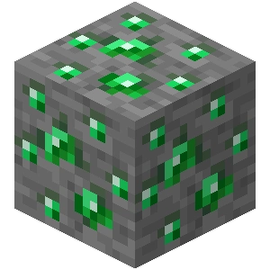 Minério de Esmeralda</td><td align="center">100</td><td></td></tr><tr><td>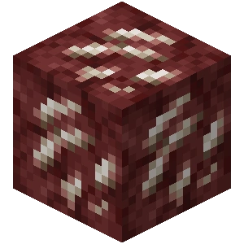 Minério de Quartzo do Nether</td><td align="center">25</td><td></td></tr><tr><td> Detritos Ancestrais</td><td align="center">250</td><td></td></tr></tbody></table>
