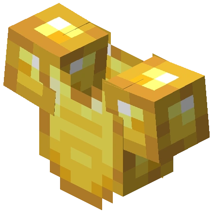
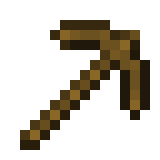
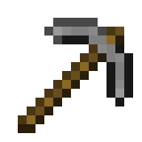
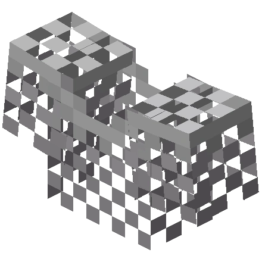
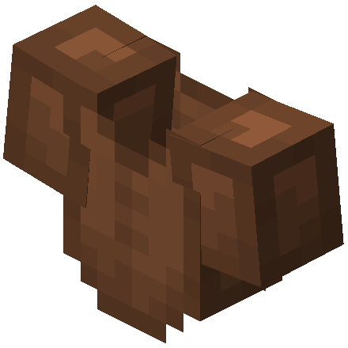
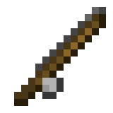
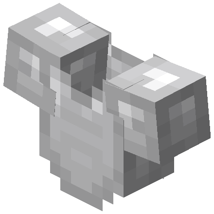
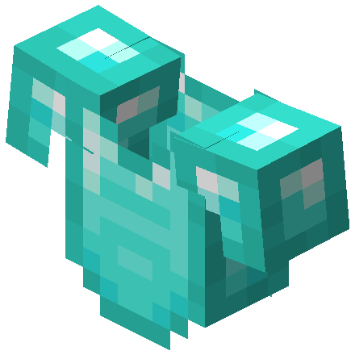
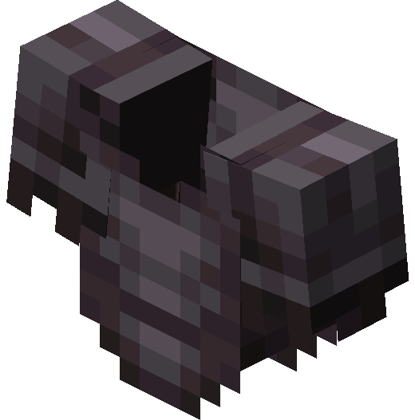

# 🕸️ Reparação

## » Habilidades


[.](./)



[mestre-reparador.md](mestre-reparador.md)



[forja-arcana.md](forja-arcana.md)



[super-reparador.md](super-reparador.md)


## » Técnicas

Coloque um detrito ancestral e clique com o botão direito para reparar o item que você está segurando no momento. Isso consome 1 item cada uso.


Cuidado ao reparar itens, se você não possuir algum vip, ou tiver menos de 1500 de reparação, você poderá perder os encantamentos do item reparado.


## » Tabela de EXP ganho

<table><thead><tr><th>» Item Reparado «</th><th align="center">» EXP «</th><th data-hidden></th></tr></thead><tbody><tr><td> Item de Ouro</td><td align="center">30</td><td></td></tr><tr><td> Item de Madeira</td><td align="center">60</td><td></td></tr><tr><td> Item de Pedra</td><td align="center">130</td><td></td></tr><tr><td> Outros Itens</td><td align="center">150</td><td></td></tr><tr><td> Item de Couro</td><td align="center">160</td><td></td></tr><tr><td> Item de Linha</td><td align="center">180</td><td></td></tr><tr><td> Item de Ferro</td><td align="center">250</td><td></td></tr><tr><td> Item de Diamante</td><td align="center">500</td><td></td></tr><tr><td> Item de Netherite</td><td align="center">600</td><td></td></tr></tbody></table>
