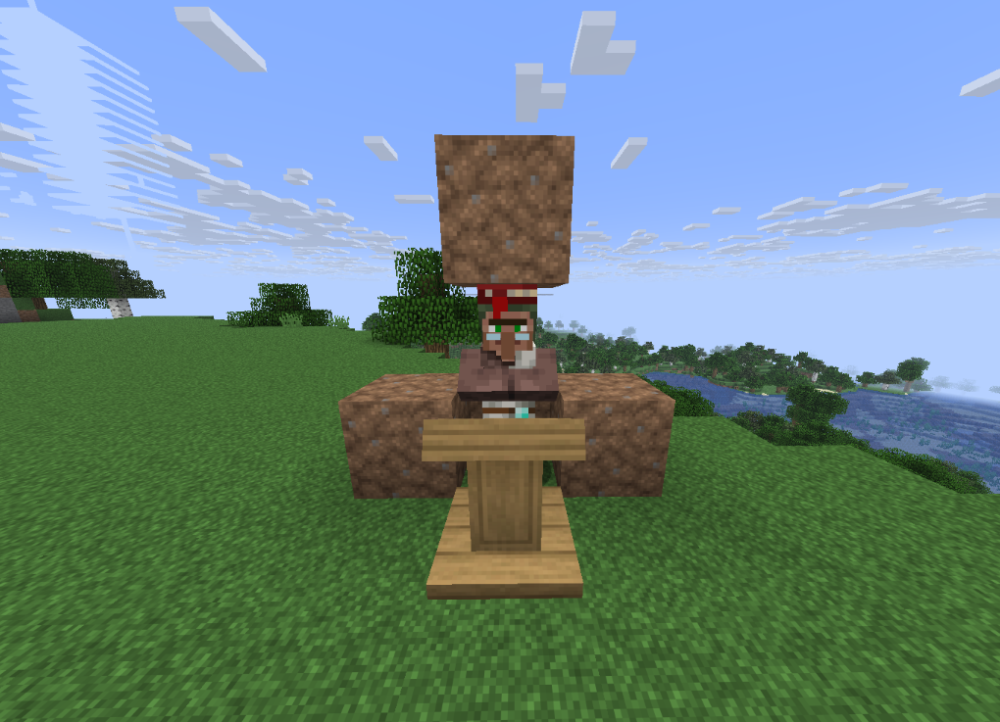

# Aldeões

## Detalhes

No servidor, algumas mecânicas dos aldeões foram modificadas para melhorar o desempenho e manter o equilíbrio, Nessa página, você conhecerá o funcionamento das trocas e as alterações realizadas neles.

### Principais diferenças

Algumas mecânicas funcionam de forma diferente do Minecraft convencional. As principais mundaças é que os aldeões não reproduzem no Survival, as trocas e redução de preço são limitadas e eles precisam ficar lobotizados para pode realizar trocas.

### Reprodução

No Minecraft, aldeões podem se reproduzir quando possuem alimentos e camas disponíveis, mas no servidor, a **reprodução está desativada**.

### Imobilização

A imobilização, também chamada de lobotomização, é a prática de deixar um aldeão parado em um local definido. Essa mecânica facilita a organizações das áreas de onde eles ficam, além de ajudar a reduzir o processamento necessário par controlar a movimentação deles.

Para realizar uma troca com o aldeão é necessário ele estar lobotizado, para isso, deixe ele sem espaços para mover, ou seja, em um espaço 1x1x2, como mostrado na imagem a seguir.

<figure><figcaption></figcaption></figure>

### Atualização

Um aldeão lobotizado, não consegue buscar bancadas de trabalho, por esse motivo, para que ele troque/remova profissão, é necessário sair desse modo de lobotização.

### Transporte

Um aldeão pode ser transportados usando botes ou jangadas e laço, também é possível teleportar eles usando o transportador de mob, que permite levar o aldeão para qualquer mundo.

###
