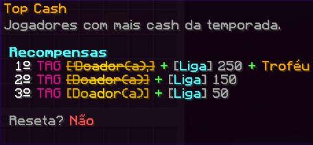
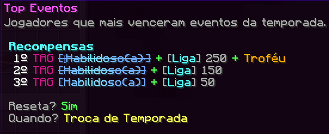

# 🎲 Temporadas


Eu perco tudo? Não, segue abaixo as informações das mudanças...


* Mundos reiniciados:
  * Nether
  * The End
  * Recurrsos
* Passe de Batalha alterado com base na nova temática e redefinido.
* Alguns rankings do Halla da Fama são redefinidos, segue as informações abaixo.

## Hall da Fama

Jogadores que estiverem no top no final de temporada, serão recompensados com itens e tags exclusivas na troca dela.

.png>)

.png>)

.png>)

.png>)

.png>)

<figure><figcaption></figcaption></figure>

<figure><figcaption></figcaption></figure>

